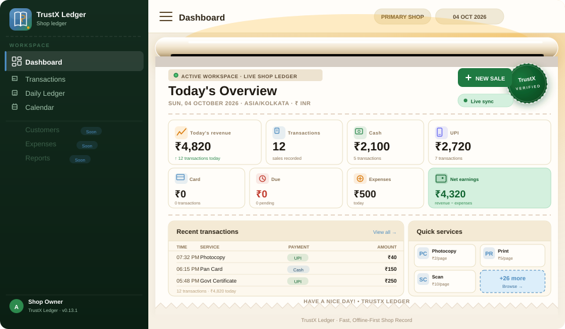
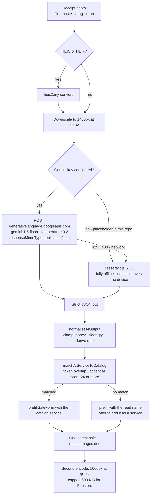
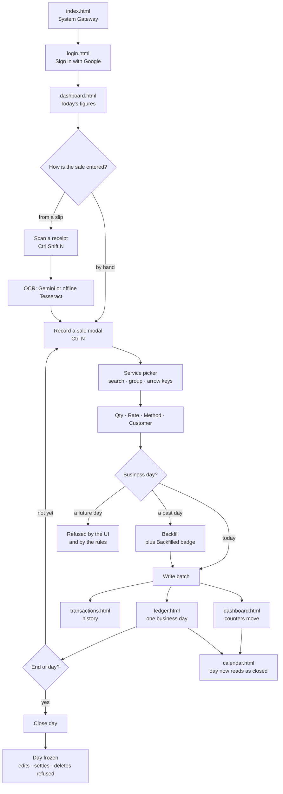
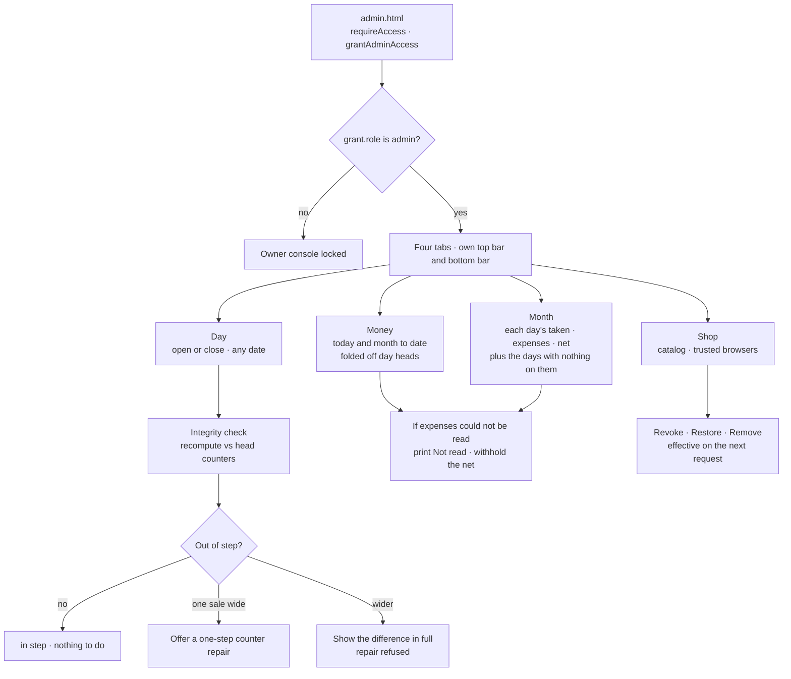
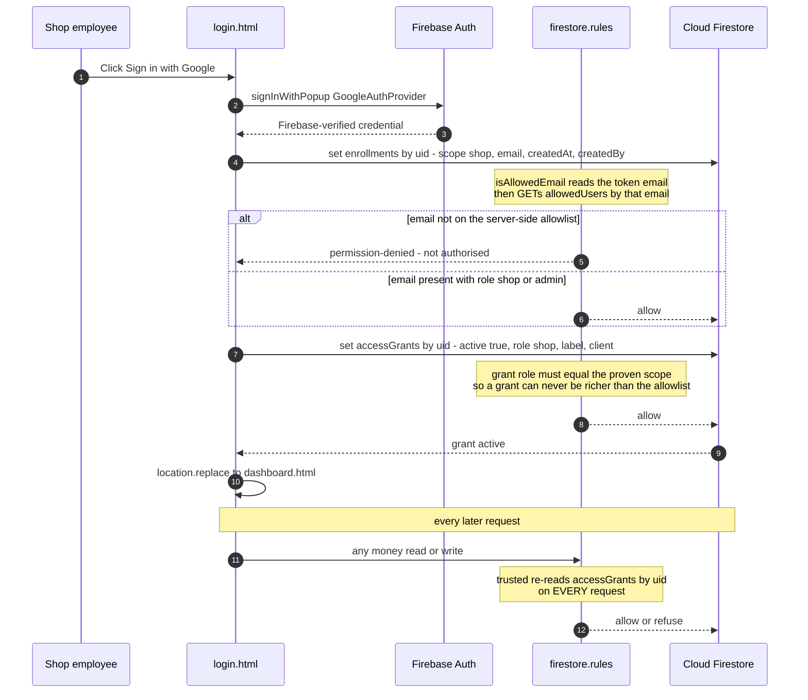
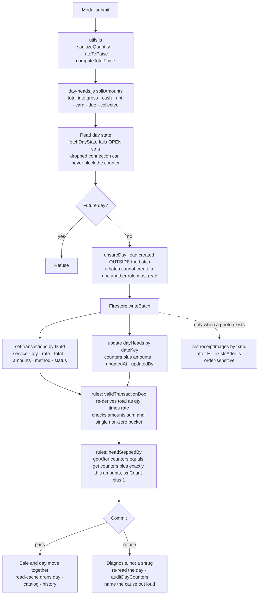
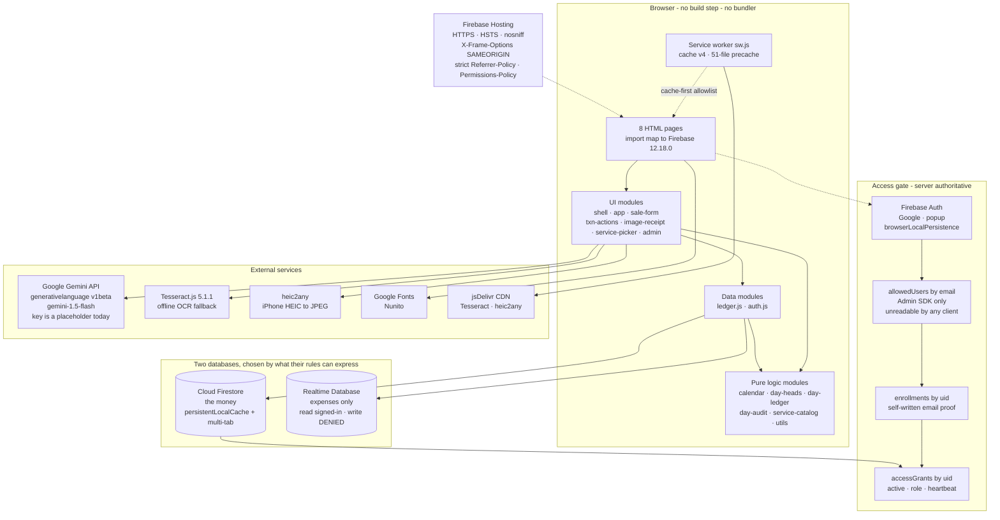
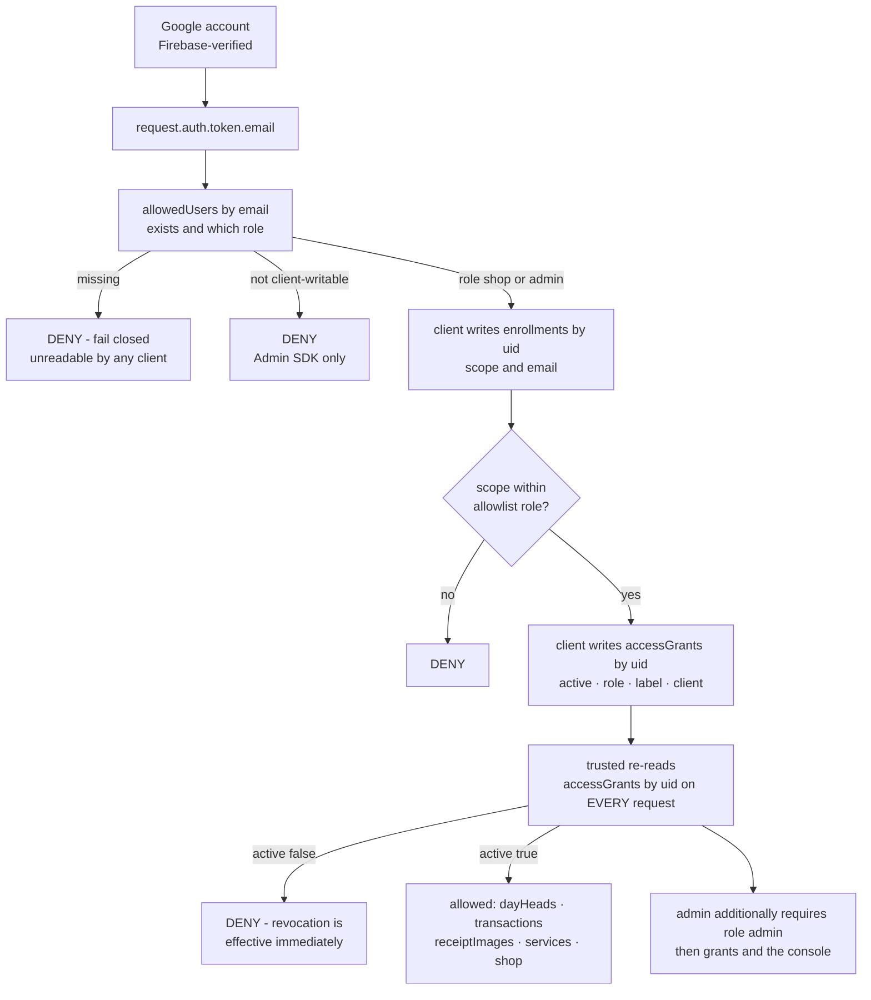

<div align="center">

<a id="top"></a>

# TrustX Ledger

### A receipt-paper digital ledger for a single-shop digital-service counter

**Offline-first · Installable · Server-enforced access · Zero build step**

<br/>

[](https://trustxplpy.web.app)
[](https://github.com/arshinmrelju/leadger)
[](https://github.com/arshinmrelju/leadger/releases)
[](https://firebase.google.com/docs/web/setup)
[](https://github.com/arshinmrelju/leadger/blob/main/package.json)
[](https://github.com/arshinmrelju/leadger/blob/main/package.json)
[](https://web.dev/progressive-web-apps/)
[](https://github.com/arshinmrelju/leadger/blob/main/tests/ledger.mjs)
[](https://github.com/arshinmrelju/leadger/blob/main/firestore.rules)

<br/>



<br/>

**The employee works in a desktop browser, next to the government portals already open in other tabs, and writes down what the counter just did — service, quantity, rate, cash/UPI/card/due — in seconds. The month fills in behind them, the day closes when the shutter comes down, and nothing has to be retyped at night.**

</div>

<hr/>

<a id="nav"></a>

## 🧭 Navigation

| | | | | |
|---|---|---|---|---|
| **[Overview](#overview)** | **[Pages](#pages)** | **[Features](#features)** | **[Architecture](#architecture)** | **[Tech Stack](#tech-stack)** |
| **[Security](#security)** | **[Database](#database)** | **[Installation](#installation)** | **[Interactive Demo](#demo)** | **[Live Demo](#live-demo)** |

| Docs | Flows | Data | Project | |
|---|---|---|---|---|
| **[Reference docs](#documentation)** | [Shop flow](#user-flow) · [Admin flow](#admin-flow) · [Auth flow](#auth-flow) · [Data flow](#data-flow) | [Atomicity](#atomicity) | [Statistics](#stats) · [Developer](#developer) | [Back to top](#top) |

---

<a id="documentation"></a>

## 📚 Documentation

This README is the showcase. These are the reference documents.

| Document | What is in it |
|---|---|
| [`docs/PAGES.md`](docs/PAGES.md) | Every page, route, overlay and control — plus the keyboard map and the PWA shortcuts |
| [`docs/ARCHITECTURE.md`](docs/ARCHITECTURE.md) | Module graph, the four tiers, load order per page, the two-database decision, offline model |
| [`docs/DATA-MODEL.md`](docs/DATA-MODEL.md) | Every Firestore and RTDB path, field by field, with the exact rule ranges |
| [`docs/SECURITY.md`](docs/SECURITY.md) | The access chain, the counter invariant, three rules-language traps, and what is **not** protected |
| [`docs/DEVELOPMENT.md`](docs/DEVELOPMENT.md) | Setup, tests, the rules harness, and all seven tool scripts |
| [`docs/SCREENS.md`](docs/SCREENS.md) | How to capture the 16 real screenshots this README still lacks |

---

<a id="overview"></a>

## 📌 Overview

TrustX Ledger is a **production-shaped, single-shop ledger** for an Indian digital-service / Akshaya-style counter. It replaces the paper day-book: services are recorded as they are sold, dues are tracked until they are settled, expenses are recorded separately from sales, and every business day can be closed so that it can no longer be quietly altered.

The interesting engineering is not the CRUD. It is that **a browser is treated as untrusted**:

- **No bundler, no build step, no `npm install`.** The Firebase SDK is pulled from a pinned CDN version through an import map. 8 HTML files + 20 ES modules run as-is.
- **The server is the authority.** A sale and the day's totals must land in **one atomic Firestore batch**, and `firestore.rules` proves the day head moved by exactly that sale's `amounts` split. A sale cannot land without the day following it.
- **Money is integer paise.** `₹10.50` is stored as `1050`. No floating point anywhere in the money path.
- **Days are `Asia/Kolkata`**, keyed `YYYY-MM-DD`. A sale can be backfilled onto a past business day; future days are refused by the UI *and* by the rules.
- **Access is a chain, not a flag.** Google account → server-side `allowedUsers` allowlist → self-written enrollment proof → `accessGrants/{uid}`. Every money rule re-reads that grant, so revoking a browser takes effect on the very next request.

### By the numbers

<div align="center">

| Pages | JS modules | CSS files | Rules | Tests | Runtime deps |
|:---:|:---:|:---:|:---:|:---:|:---:|
| **8** | **20** | **9** | **978** | **142** | **0** |

</div>

`978` = 923 lines of `firestore.rules` + 55 lines of `database.rules.json`.
`142` Node tests via `node --test` — see [Testing](#testing) for the current honest pass/fail count.

<details>
<summary><b>📦 What is actually in the repository</b> (70 tracked files)</summary>

```
TrustX Ledger/
├── ENTRY + AUTH
│   ├── index.html            128 lines   System Gateway receipt card · SW registration
│   ├── login.html            207 lines   Google Sign-In (receipt-paper UI)
│   └── offline.html          112 lines   Service-worker offline fallback
│
├── SHOP WORKSPACE  (signed-in + trusted device)
│   ├── dashboard.html        713 lines   Today · 8 stat cards · recent sales · quick services
│   ├── calendar.html         538 lines   Month grid · recorded / closed / missing / future
│   ├── ledger.html           746 lines   One business day · filters · totals · close & reopen
│   └── transactions.html     623 lines   All-time or single-day history · search · grouped
│
├── ADMIN  (admin role only · deliberately NOT in the nav)
│   └── admin.html            231 lines   Owner console → js/admin.js · no app shell
│                                            Money · Month · Day · Shop
│
├── OVERLAYS  (modals, not pages)
│   ├── Record a sale                 js/sale-form.js
│   ├── Scan a receipt                js/image-receipt.js
│   ├── Edit a sale                   js/txn-actions.js
│   ├── View receipt photo            js/txn-actions.js
│   └── Confirm / alert               js/app.js
│
├── js/  20 modules · 11,284 lines
│   ├── firebase.js         SDK bootstrap · lazy import · offline persistence
│   ├── auth.js             Google Sign-In · enrollment · grants · admin promotion
│   ├── ledger.js           the only module that writes money
│   ├── sale-form.js        shared "Record a sale" modal
│   ├── txn-actions.js      edit · settle · delete · receipt view · refusal diagnosis
│   ├── image-receipt.js    Gemini OCR + offline Tesseract OCR + catalog matching
│   ├── service-picker.js   WAI-ARIA combobox over the service catalog
│   ├── service-catalog.js  38 seed services in 8 sortOrder bands  (pure)
│   ├── calendar.js         month-grid logic                            (pure)
│   ├── day-heads.js        day counters + per-method split             (pure)
│   ├── day-ledger.js       single-day view logic                       (pure)
│   ├── day-audit.js        day-integrity check + repair plan          (pure)
│   ├── admin.js            Owner console (4 tabs, own layout, no shell)
│   ├── shell.js            shared protected-page bootstrap
│   ├── app.js              toasts · modals · sidebar · global errors
│   ├── utils.js            paise · Asia/Kolkata dates · validation
│   ├── quota.js            Spark-plan usage metering + quota wall
│   ├── read-cache.js       stale-while-revalidate read cache
│   ├── pwa.js              service-worker registration + install/update
│   ├── ai-config.js        Gemini model config (key is a placeholder)
│   └── read-cache / quota / …  no cycles — leaves → firebase → auth/ledger → UI
│
├── css/  9 files · 5,400 lines  (style · forms · dashboard · transactions ·
│                                   ledger · calendar · admin · responsive · mobile)
├── tests/  3 files · 3,263 lines  (ledger · calendar · module-graph)
├── tools/  7 Node scripts       (bootstrap-access · rules-check · make-icons · …)
├── assets/ 10 files             (logo · favicon · PWA icons · coins · banner · sound)
├── firestore.rules       923 lines   the money
├── database.rules.json    55 lines   expenses + fail-closed legacy paths
├── firestore.indexes.json             empty — the day key is the partition
├── sw.js                 342 lines   cache v4 · 51-file precache
├── manifest.webmanifest              4 app shortcuts
├── firebase.json                    hosting + both rule sets + emulators + headers
└── package.json                      2 scripts, 0 dependencies
```

> Every module marked *(pure)* imports nothing from Firebase, which is what lets `tests/ledger.mjs` and `tests/calendar.mjs` exercise the real production logic in Node.

</details>

---

<a id="demo"></a>

## 🧪 Interactive Demo

There are no screenshots in this repository, so this section reconstructs the real UI from the actual markup and CSS rather than showing pictures of something else. Everything below is derived from the code.

### The dashboard, as the browser draws it

`assets/readme-banner.svg` is a **pixel-faithful SVG replica of `dashboard.html`**, committed in the repo and regenerated from the real markup:

<div align="center">

<br/>
<small>Deep-green sidebar · parchment receipt panel with a torn bottom edge ·
eight stat cards · recent transactions · quick-services grid</small>
</div>

### The receipt-paper shell, in text

Every screen in the app is a **receipt** — a warm parchment card with a dispenser slot above it, a green `VERIFIED` stamp, monospaced metadata rows, a torn serration at the bottom and `HAVE A NICE DAY!` as the footer note. This is the actual DOM from `login.html`:

```text
   ┌───────────────────────────────┐   ╔════════════════════════════╗
   │▔▔▔▔▔▔▔▔▔▔▔▔▔▔▔▔▔▔▔▔▔▔▔▔▔▔▔▔▔│   ║   [ dispenser slot ]        ║  ← warm metal bar
   └───────────────────────────────┘   ╚════════════════════════════╝
   ┌───────────────────────────────────────────────┐
   │ SECURE ACCESS                     ╭─────────╮ │  ← .receipt-stamp
   │ TrustX Ledger                     │ TrustX  │ │     green stamp,
   │ Digital Shop Ledger • ₹ INR       │VERIFIED │ │     rotated
   │ ─────────────────────────────────────────────│
   │ LEDGER MODE            SHOP WORKSPACE          │
   │ SECURITY PROTOCOL      GOOGLE SIGN-IN          │
   │ TIMESTAMP              04 OCT 2026             │  ← live, from Date
   │ ─────────────────────────────────────────────│
   │  ┌─────────────────────────────────────────┐  │
   │  │  [ G ]  Sign in with Google          →  │  │  ← .btn-google
   │  └─────────────────────────────────────────┘  │
   │ ─────────────────────────────────────────────│
   │            H A V E   A   N I C E   D A Y !    │
   └───────────────────────────────────────────────┘
        ▂▂▃▃▅▅▆▆▇▇▆▆▅▅▃▃▂▂   ← .receipt-tear-edge (serrated)
```

<a id="record-a-sale"></a>

### Record a sale — the shared modal

Opened with the `NEW TRANSACTION` button, <kbd>Ctrl</kbd>/<kbd>⌘</kbd>+<kbd>N</kbd>, or the `+` on any calendar day. All markup below is from `js/sale-form.js`:

```text
┌─ RECORD A SALE ────────────────────────────────────────┐
│                                                        │
│  Business day *        [ 2026-10-04 ]  ← backfill any   │
│                        past day; future days refused    │
│                                                        │
│  Service *             ┌──────────────────────────┐    │
│    ⚙ [ Search or pick…] │              N services▾ │    │
│                        └──────────────────────────┘    │
│                        ┌──────────────────────────┐    │
│                        │ PRINTING & DOCUMENT      │ ← sticky group heading
│                        │ [NP] Normal Printing   ₹0│    │
│                        │ [CP] Colour / Photo    ₹0│    │
│                        │ [SC] Scanning          ₹0│    │
│                        │ COMPUTER & DTP          │    │
│                        │ [DT] DTP / Typing      ₹0│    │
│                        └──────────────────────────┘    │
│                                                        │
│  Quantity             [ 1 ]      Rate (₹)  [ 0.00 ]    │
│                                       Total  ₹0.00     │
│                                                        │
│  Payment method *   (●) Cash  ( ) UPI  ( ) Card  ( ) Due
│                                                        │
│  Customer (optional) [                      ]           │
│                                                        │
│  [ 📷 Scan receipt ]                       [ Cancel ]   │
│                              [      SAVE SALE      ]    │
└────────────────────────────────────────────────────────┘
```

**What the UI enforces before the write even leaves the browser** — and what the rules re-check independently:

| Field | Rule |
|---|---|
| Quantity | whole number, `1 … 100000` |
| Rate | `₹0 … ₹1,00,000` per unit, parsed to integer paise |
| Total | derived, never typed — `quantity × rate`, and must be a safe integer `≤ ₹1,00,00,00,000` |
| Payment | exactly one of `cash · upi · card · due`; only the chosen bucket may be non-zero |
| Status | `due ⇒ pending`, everything else ⇒ `paid` |
| Business day | valid `YYYY-MM-DD`, **not in the future** |
| Service | must exist in `services/` and be `active` |

### The calendar — four different kinds of "empty"

This is the single most opinionated thing in the app. A day with no sales is drawn as an **outline**, never as `₹0`, because *"nothing was entered here"* and *"nothing was sold here"* are different facts and only one of them is a gap in the books.

```text
        ◀   OCTOBER 2026   ▶   [This month] [Refresh]
   Mon  Tue  Wed  Thu  Fri  Sat  Sun
    28    29    30    01    02    03    04
   ┄┄┄┄┄┄┄┄┄┄┄┄┄┄┄┄┄┄┄┄┄┄┄┄┄┄┄┄┄┄┄┄┄┄┄┄┄┄┄┄┄┄┄┄┄┄┄┄┄┄┄┄
    05    06    07    08    09    10    11
   ┌───┐┌───┐┌───┐┌═══┐┌───┐┌───┐┌───┐
   │   ││   ││   ││▓▓▓││   ││   ││   │   ← filled = recorded
   │ + ││ + ││ + ││▓▓▓││ + ││ + ││ + │   ← "+" opens the sale form
   └───┘└───┘└───┘└═══┘└───┘└───┘└───┘      for that day, in place
    12    13    14    15    16    17    18
   ┌───┐┌───┐┌───┐┌───┐┌───┐┌───┐┌───┐
   │▓▓▓││   ││   ││   ││   ││   ││   │   ← outline = nothing entered
   └───┘└───┘└───┘└───┘└───┘└───┘└───┘
    19    20    21    22    23    24    25
   ┏━━━┓┌───┐┌───┐┌───┐┌───┐┌───┐┌───┐
   ┃🔒 ┃│   ││   ││   ││   ││   ││   │   ← locked = closed day
   ┗━━━┛└───┘└───┘└───┘└───┘└───┘└───┘      no edit/settle/delete
    26    27    28    29    30    31    01
   ┄┄┄┄┄┄┄┄┄┄┄┄┄┄┄┄┄┄┄┄┄┄┄┄┄┄┄┄┄┄┄┄┄┄┄┄┄┄┄┄┄┄┄┄┄┄┄┄┄┄┄┄
   legend:  ▓ recorded   🔒 closed   ▢ nothing entered   ░ not yet
```

Below the grid, a **catch-up panel** lists the days still to fill in (up to 8), each with its own `+`. Catching up a missed week is a sequence of short taps and never a second visit to the ledger page.

### Scan a receipt — two OCR paths

<kbd>Ctrl</kbd>/<kbd>⌘</kbd>+<kbd>Shift</kbd>+<kbd>N</kbd>, or the `SCAN RECEIPT` button on the dashboard.



> **Right now the Gemini key in `js/ai-config.js` is the literal placeholder `YOUR_GEMINI_API_KEY_HERE`, so the shipped app runs the offline Tesseract path.** The Gemini branch is real code and is documented here because it exists — not because it is switched on. See [Integrations](#integrations).

### Keyboard map

| Keys | Action | Registered in |
|---|---|---|
| <kbd>Ctrl</kbd>/<kbd>⌘</kbd>+<kbd>N</kbd> | Record a sale | `js/shell.js` (every protected page) |
| <kbd>Ctrl</kbd>/<kbd>⌘</kbd>+<kbd>Shift</kbd>+<kbd>N</kbd> | Scan a receipt | `js/image-receipt.js` (module load) |
| <kbd>Esc</kbd> | Close the topmost overlay, else the mobile sidebar | `js/app.js` |
| <kbd>↑</kbd><kbd>↓</kbd> <kbd>Home</kbd> <kbd>End</kbd> <kbd>Enter</kbd> <kbd>Tab</kbd> | Navigate / choose / commit inside the service picker | `js/service-picker.js` |
| <kbd>Enter</kbd> / <kbd>Space</kbd> | Open the file picker from the receipt drop zone | `js/image-receipt.js` |

---

<a id="pages"></a>

## 🗺️ Pages

**8 pages. All 8 are deployed and reachable — verified live, all returning HTTP 200.**
Every page except `index.html`, `login.html` and `offline.html` redirects to the sign-in gate unless the browser already holds an active access grant.

```text
╔══════════════════════════════════════════════════════════════════════════╗
║  PROJECT EXPLORER — TrustX Ledger                          8 pages       ║
╠══════════════════════════════════════════════════════════════════════════╣
║                                                                          ║
║  PUBLIC                                                                  ║
║  🏠  System Gateway ·············· index.html         /          [open]  ║
║  🔐  Sign in ····················· login.html         /login.html  [open]  ║
║  📴  Offline fallback ············ offline.html       /offline.html[open] ║
║                                                                          ║
║  SHOP WORKSPACE — signed in + trusted browser                            ║
║  📊  Dashboard ··················· dashboard.html     /dashboard   [open]  ║
║  📅  Calendar ···················· calendar.html      /calendar    [open]  ║
║  📒  Daily Ledger ················ ledger.html        /ledger      [open]  ║
║  🧾  Transaction history ········ transactions.html  /transactions[open]  ║
║                                                                          ║
║  ADMIN — admin role only, deliberately not in the nav                    ║
║  🛡️  Owner console ··············· admin.html         /admin       [open]  ║
╚══════════════════════════════════════════════════════════════════════════╝
```

**Every row is a live link.** The page name jumps to its section below; *source* opens the file on GitHub.

| Page | Route | Access | Source · Live |
|---|---|---|---|
| 🏠 **System Gateway** | `/` | public | [`index.html`](https://github.com/arshinmrelju/leadger/blob/main/index.html) · [open](https://trustxplpy.web.app/) |
| 🔐 **Sign in** | `/login.html` | public | [`login.html`](https://github.com/arshinmrelju/leadger/blob/main/login.html) · [open](https://trustxplpy.web.app/login.html) |
| 📊 **Dashboard** | `/dashboard.html` | trusted | [`dashboard.html`](https://github.com/arshinmrelju/leadger/blob/main/dashboard.html) · [open](https://trustxplpy.web.app/dashboard.html) |
| 📅 **Calendar** | `/calendar.html` | trusted | [`calendar.html`](https://github.com/arshinmrelju/leadger/blob/main/calendar.html) · [open](https://trustxplpy.web.app/calendar.html) |
| 📒 **Daily Ledger** | `/ledger.html?date=` | trusted | [`ledger.html`](https://github.com/arshinmrelju/leadger/blob/main/ledger.html) · [open](https://trustxplpy.web.app/ledger.html) |
| 🧾 **Transaction History** | `/transactions.html` | trusted | [`transactions.html`](https://github.com/arshinmrelju/leadger/blob/main/transactions.html) · [open](https://trustxplpy.web.app/transactions.html) |
| 🛡️ **Owner Console** | `/admin.html` | **admin** | [`admin.html`](https://github.com/arshinmrelju/leadger/blob/main/admin.html) · [open](https://trustxplpy.web.app/admin.html) |
| 📴 **Offline Fallback** | `/offline.html` | public | [`offline.html`](https://github.com/arshinmrelju/leadger/blob/main/offline.html) · [open](https://trustxplpy.web.app/offline.html) |

Jump to a section: [Gateway](#page-index) · [Sign in](#page-login) · [Dashboard](#page-dashboard) · [Calendar](#page-calendar) · [Ledger](#page-ledger) · [History](#page-transactions) · [Console](#page-admin) · [Offline](#page-offline)

Plus five overlays that are modals rather than pages: [**Record a sale**](#record-a-sale) · Scan a receipt · Edit a sale · View receipt photo · Confirm

Base URL for every live link: **`https://trustxplpy.web.app/`** · All 8 pages verified **HTTP 200**.

---

<a id="page-index"></a>

### 🏠 System Gateway — `index.html`

**Route** `/` · **Access** public · **128 lines**

> Entry point. A receipt card stamped `SYSTEM GATEWAY` that prints the current date, carries one button — `SIGN IN WITH GOOGLE` — and registers the service worker **before** anyone signs in, so the installed app is already cached and offline-ready on first open.

**Features**

- Live date stamp (`26 SEP 2026` style, computed in-page)
- One primary action: `SIGN IN WITH GOOGLE` → `login.html`
- Receipt aesthetic matching `css/forms.css` — dispenser, stamp, torn edge, `HAVE A NICE DAY!`
- Registers `sw.js` at module load — deliberately the *first* page a shop ever sees
- Imports no Firebase. Renders with no network at all.

🔗 [Open live](https://trustxplpy.web.app/) · [Source](https://github.com/arshinmrelju/leadger/blob/main/index.html)

**Related** → [Sign in](#page-login) · [Offline fallback](#page-offline)

---

<a id="page-login"></a>

### 🔐 Sign in — `login.html`

**Route** `/login.html` · **Access** public · **207 lines**

> Google Sign-In on a `SECURE ACCESS` receipt. The button is the only control. Four distinct outcomes are told apart and each gets its own message, because *"this browser is not enrolled"* and *"this browser was revoked"* need different actions.

**Features**

- `Sign in with Google` → Firebase `GoogleAuthProvider` **popup** (the only sign-in path in the app)
- Alert region (`role="alert"`) for every failure, mapped from Firebase error codes to shop language
- **Auto-forward:** a browser that already holds an active grant never sees this page — it is sent straight to `dashboard.html`
- Query-string reasons rendered distinctly: `?reason=signedout` · `?reason=revoked` · `?reason=not-enrolled`
- Pre-flight `isConfigured()` check — refuses cleanly with a warning if `js/firebase.js` still has placeholders
- `No-email` is caught **before** any write, so an account with no address is never misreported as "not authorised"

🔗 [Open live](https://trustxplpy.web.app/login.html) · [Source](https://github.com/arshinmrelju/leadger/blob/main/login.html)

**Related** → [Gateway](#page-index) · [Security](#security)

<details>
<summary><b>Exact refusal messages a shopkeeper can be shown</b></summary>

| Condition | Message |
|---|---|
| Not configured | `Firebase is not configured yet. Add your web app config in js/firebase.js.` |
| Not on the allowlist | `That Google account is not authorised for this shop. Check with the shop administrator.` |
| No shared email | `This Google account did not share an email address, so it cannot be checked against the shop's list. Try a different account.` |
| Provider disabled | `Google Sign-In is not enabled for this Firebase project. Enable it under Authentication → Sign-in method.` |
| Popup closed | `The Google Sign-In popup was closed before completing.` |
| Popup blocked | `The Google Sign-In popup was blocked. Allow popups for this site and try again.` |
| Firebase throttling | `Too many attempts. Please wait a few minutes and try again.` |
| Daily quota spent | `This shop has used up today's free Firebase limit, so nothing can be saved until it resets. Nothing you entered has been lost — try again after the reset.` |
| RTDB unreachable | `Realtime Database is not reachable. Check databaseURL in js/firebase.js and that database.rules.json is deployed.` |

A write refused by the rules is **never** reported as a sign-in failure — quota is classified before the error-code switch, precisely so the two are not confused.

</details>

---

<a id="page-dashboard"></a>

### 📊 Dashboard — `dashboard.html`

**Route** `/dashboard.html` · **Access** signed-in + trusted · **713 lines**
**Also the PWA `start_url` and `id`** — this is the app's home.

> Today's workspace. Eight figures for the current Kolkata business day, the most recent sales, and a grid of the twelve most-used services that pre-fill the sale dialog on tap.

**Features**

- **Eight stat cards**, each an SVG icon + value: **Revenue · Count · Cash · UPI · Card · Due · Expenses · Net**
- Revenue card carries a note; Net is coloured against zero
- **Recent transactions** table — time, service, qty × rate, total, payment-method chips (including *pending*), customer, status; `View history` link; `Refresh` with a loading state
- **Quick services** grid — up to 12 tiles, tap to open the sale form pre-filled with that service
- `SCAN RECEIPT` · `NEW TRANSACTION` · `Refresh` · `Record a sale` (empty state) · `Add services`
- Day-rollover aware: `onDayChange` reloads when Kolkata crosses midnight
- `onSaleRecorded` reloads after any sale anywhere in the app

🔗 [Open live](https://trustxplpy.web.app/dashboard.html) · [Source](https://github.com/arshinmrelju/leadger/blob/main/dashboard.html)

**Related** → [Daily Ledger](#page-ledger) · [History](#page-transactions) · [Record a sale](#demo)

<details>
<summary><b>Where each of the eight numbers comes from</b></summary>

| Card | Source |
|---|---|
| Revenue | `dayHeads/{today}.counters.grossPaise` |
| Count | `counters.txnCount` |
| Cash / UPI / Card / Due | `counters.cashPaise` · `upiPaise` · `cardPaise` · `duePaise` |
| **Collected** *(implied)* | `counters.collectedPaise = gross − due` — enforced by the rules |
| Expenses | Realtime Database `expenses/{today}/*` — **read-only**, no client write path |
| Net | `grossPaise − expenses`, coloured against zero |

The dashboard reads the day head, which is why the counters must be provably correct — see [Atomicity](#atomicity).

</details>

---

<a id="page-calendar"></a>

### 📅 Calendar — `calendar.html`

**Route** `/calendar.html` · **Access** signed-in + trusted · **538 lines**

> A Monday-first month grid that answers the only question that matters at closing time: *which days are done, and which have not been written up at all?*

**Features**

- Four day statuses, never conflated: **recorded · closed · nothing entered · not yet**
- Day cell shows the day's gross and sale count; closed days get a lock glyph and lose their `+`
- **`+` on a day opens the sale form for that day in place** — no navigation, no losing your place in the month
- `◀ Previous month` · month label (`aria-live`) · `Next month` *(disabled at the current month)* · `This month` · `Refresh this month`
- **Summary card** — month gross, sale count, days recorded, days still to fill in
- **Catch-up panel** — up to 8 missing days, each with its own `+`
- Day cells link into `ledger.html?date=YYYY-MM-DD`; the ledger writes that key back to the URL
- Refresh re-reads the month rather than trusting a stale read

🔗 [Open live](https://trustxplpy.web.app/calendar.html) · [Source](https://github.com/arshinmrelju/leadger/blob/main/calendar.html)

**Related** → [Daily Ledger](#page-ledger) · [Backfill](#backfill) · [Day closing](#closing)

> The grid logic lives in `js/calendar.js`, which imports nothing from Firebase — that is why `tests/calendar.mjs` can assert month bounds, missed-day detection, backfilled-row marking and totals in plain Node.

---

<a id="page-ledger"></a>

### 📒 Daily Ledger — `ledger.html`

**Route** `/ledger.html?date=YYYY-MM-DD` · **Access** signed-in + trusted · **746 lines**

> One business day in full: every sale, the day's totals computed from the rows, and the controls to close or reopen the day.

**Features**

- Day navigation: `◀ Previous day` · date input · `Next day` · `Today` — the date lives in the URL, so a day is linkable and survives a refresh
- **Filters:** search (service or customer, debounced 250 ms) · payment method · status
- **Row actions** per sale: `View receipt photo` *(when one exists)* · `Mark paid` *(only for a pending due)* · `Edit sale` · `Delete sale`
- **Backfilled** badge beside the time of any row entered after its business day
- **Day totals** rendered from the rows on screen, not from the stored counters
- Cursor paging, 100 rows a page, `Load more`
- **Closed banner** + `Close day` / `Reopen day`, both behind a confirmation that quotes the sale count and total
- `Record sale` is disabled while the day is closed
- Follows Kolkata midnight if you were looking at today; jumps to the new day after a backfilled sale is recorded

🔗 [Open live](https://trustxplpy.web.app/ledger.html) · [Source](https://github.com/arshinmrelju/leadger/blob/main/ledger.html)

**Related** → [Calendar](#page-calendar) · [Backfill](#backfill) · [Closing](#closing) · [Atomicity](#atomicity)

---

<a id="page-transactions"></a>

### 🧾 Transaction History — `transactions.html`

**Route** `/transactions.html[?date=YYYY-MM-DD]` · **Access** signed-in + trusted · **623 lines**

> Every sale ever recorded, or one day of them. Search and filter run on the loaded rows; the scope switch changes what is fetched.

**Features**

- Four stat cards: **Count · Total · Paid · Due**
- Scope: **All time** or **one day**, chosen by the URL, the date input, or the `Today` / `All time` buttons
- Filters: search customer or service (debounced 160 ms) · payment method · `Clear`
- **Rows grouped under day headings**, so a month still reads as a sequence of days
- Footer states honestly when the result set was capped
- Row actions identical to the ledger, and disabled on a closed day
- `New transaction` pre-fills the day when the history is pinned to a day
- Empty state offers `Record a sale` for that exact day

🔗 [Open live](https://trustxplpy.web.app/transactions.html) · [Source](https://github.com/arshinmrelju/leadger/blob/main/transactions.html)

**Related** → [Daily Ledger](#page-ledger) · [Dashboard](#page-dashboard)

---

<a id="page-admin"></a>

### 🛡️ Owner Console — `admin.html`

**Route** `/admin.html` · **Access** **`admin` role only** · **231 lines shell + `js/admin.js`**
**Deliberately not in the sidebar nav.** Reached by URL.

> Not a settings page, and not a developer page. This is the screen a shop owner opens
> on a phone to answer four questions: how did today go, which days of this month are
> missing, can I close a day and is that day in step, and who still has access.

**The one page with no app shell.** It builds its own top bar and a fixed four-tab bottom
bar instead of calling `initAppShell()`. Inheriting the daily navigation would put sale
entry one tap away from day-close and integrity actions, and the console has no business
being the shop's front door. `initOwnerConsole()` drives it.

**Gate** `requireAccess()` with `grantAdminAccess()`, which promotes a browser holding
active `shop` trust by presenting an `admin`-scope proof — and, more importantly, every
read and write below is refused by `firestore.rules` unless
`accessGrants/{uid}.role == 'admin'`. A non-admin gets a locked gate, not a page.

**Four tabs**

| Tab | What it answers |
|---|---|
| **Money** | Today's taken, collected, due, expenses and net — then the same five for the month to date |
| **Month** | Which days this month contains, what each day took and netted, and which days have nothing on them |
| **Day** | Any date: open or close it, then check that its head adds up |
| **Shop** | The service catalog (name, rate, archive) and the browsers allowed to open the ledger |

**Everything is folded off day heads,** not summed from sales, so a month costs one query
rather than a read per sale. A day that has not been recorded shows as *nothing*, never as
a zero — the difference matters when you are looking for the gap.

**Month gaps are found, not hidden.** A finished month is scanned whole; a past month used
to be scanned only as far as its last recorded day, which quietly declared every later day
outside the ledger. Days with nothing on them are listed by name under the table.

**Closing a day is enforced by `firestore.rules`,** not by the UI. Every sale write against
a closed day is refused. Re-opening it is how a sale typed against the wrong day gets
fixed, and it is deliberately on the same tab as the integrity check — both are questions
about one day. The check recomputes the counters from the day's rows, changes nothing, and
offers a one-step repair when the difference is exactly one sale wide.

**A figure the console cannot vouch for is not printed.** `fetchTodaySummary()` leaves
expenses at `0` when the Realtime Database read fails and flags it, because "nothing was
spent" and "we could not read" are otherwise the same number. Expenses show as `Not read`
and the net is withheld rather than shown too high by exactly the amount nobody could read.
The same holds for the month.

**Removed, not moved:** the **Free plan usage** card (the quota layer still counts and
still raises its own exhausted banner — the owner is not asked to manage a meter's read
budget) and **All data** (it read every recent sale in the app; the Money and Month tabs
answer the same question off day heads).

**Dues stop at the month, on purpose.** Money shows what is due today and what is due this
month, both folded off day heads. It does **not** show an all-time outstanding total, and
that is a decision rather than an omission: Firestore charges one read per matching
document, so an all-time figure would cost a read per unpaid sale in the shop's history —
past the app's own 50-read daily budget on a shop with more than about fifty open dues, and
left on screen as an error rather than a number. Every unpaid sale from any month is on the
**Sales** screen.

🔗 [Open live](https://trustxplpy.web.app/admin.html) · [Source](https://github.com/arshinmrelju/leadger/blob/main/admin.html)

**Related** → [Security](#security) · [Admin flow](#admin-flow) · [Day integrity](#day-integrity)

---

<a id="page-offline"></a>

### 📴 Offline Fallback — `offline.html`

**Route** `/offline.html` · **Access** public · **112 lines**

> The last resort. If the service worker has no cached copy of the page you asked for and there is no connection, this is served instead — so an installed app never shows a blank white void.

**Features**

- Same receipt aesthetic, stamped `NO CONNECTION`
- Two honest states: `NOT CACHED YET` and `NO CONNECTION`, chosen from `navigator.onLine`
- `YOUR DATA — SAFE ON THIS DEVICE` — Firestore's persistent local cache holds unsynced writes
- Safe exits: `Today's takings` → dashboard, `Day ledger` → ledger
- `Retry` re-attempts the navigation

🔗 [Open live](https://trustxplpy.web.app/offline.html) · [Source](https://github.com/arshinmrelju/leadger/blob/main/offline.html)

**Related** → [PWA](#pwa) · [Offline-first](#offline-first)

---

<a id="flows"></a>

## 🔀 Flows

### <a id="user-flow"></a>Shop Flow — recording the day



### <a id="admin-flow"></a>Admin Flow



Two things the diagram leaves out on purpose. **Free plan usage is gone** — the quota layer
still counts and still raises its own exhausted banner, but no card asks the owner to
manage a meter's read budget. **All data is gone** — it read every recent sale in the app,
and the Money and Month tabs answer the same question off day heads for one query per
month instead of a read per sale.

### <a id="auth-flow"></a>Authentication Flow

The access chain is four documents deep, and **the client cannot skip a link**.



**Revocation is immediate.** `trusted()` reads the grant on every request rather than trusting a token, so flipping `active: false` in the console locks that browser out on its very next read — no sign-out, no waiting for a session to expire.

### <a id="data-flow"></a>Data Flow — one sale

The write path is the heart of the app. A sale and the day's totals are **one atomic batch**, and the rules independently prove the head moved by exactly that sale's amounts split.



<a id="atomicity"></a>

### Why the batch matters

`firestore.rules` cannot re-sum a subcollection, so the app proves each sale individually:

| Operation | What the rules demand of the day head |
|---|---|
| **Create** | `getAfter.counters == get.counters + thisSale.amounts`, and `txnCount + 1` |
| **Update** | `getAfter.counters == get.counters + (newAmounts − oldAmounts)`, `txnCount` unchanged |
| **Delete** | `getAfter.counters == get.counters − thisSale.amounts`, `txnCount − 1` |

A client that lies in `amounts` therefore **cannot move a day's counters by an amount its own sale does not account for** — and a sale cannot land without the day following it.

Because the head cannot see the sale, a write to the head *alone* is bounded by `boundedCounterStep`: `txnCount` may move by ±1 and any money field by ±`100000000000` paise. That is why the daily ledger **always recomputes its totals from the rows** — the pages that matter never trust the counters.

`js/day-heads.js` mirrors every one of these functions in pure JavaScript, and `tests/ledger.mjs` reads `firestore.rules` off disk and asserts the constants still match.

---

<a id="architecture"></a>

## 🏗 Architecture



### Layering

```text
leaves (pure, Firebase-free, Node-testable)
  utils · quota · read-cache · pwa · ai-config · service-catalog
  calendar · day-heads · day-ledger · day-audit
        ↓
  firebase.js          SDK bootstrap, lazy import, offline persistence
        ↓
  auth.js   ledger.js  access + data
        ↓
  service-picker · sale-form · image-receipt · txn-actions
        ↓
  shell.js   admin.js   app shell + console
```

**No cycles.** `tests/module-graph.mjs` walks the real import graph and asserts every named import resolves to a real export — and that no dead exports accumulate.

### Why two databases

It is not an accident of history; it is a decision about rule languages.

- **Firestore rules can `get()` a document.** That is what lets `trusted()` read `accessGrants/{uid}` on every request.
- **Realtime Database rules cannot read another document.** A rule language that cannot see the trust record cannot enforce it — so access control, devices, enrollments, catalog and shop identity all moved *into* Firestore, next to the money.
- **Expenses stayed in RTDB**, which left them behind a gap the project documents honestly. See [Known gaps](#known-gaps).

`firestore.indexes.json` is empty on purpose: the business day is the partition, so **no composite index is required**.

---

<a id="features"></a>

## ✨ Features

Every block below corresponds to code that exists in this repository.

<details>
<summary><b>🔐 Google Sign-In + server-side allowlist</b> — <code>js/auth.js</code>, <code>firestore.rules</code></summary>

The whole access model in one paragraph: there is **no device secret and no access code**. The Google session's `uid` *is* the browser identity. A Firestore `allowedUsers/{email}` document — writable only by `tools/bootstrap-access.mjs` through the Admin SDK, and **unreadable and unwritable by any client** — is proven in `enrollments/{uid}`, which trades for an `accessGrants/{uid}` record that every money rule re-reads on every request.

**The grant cannot exceed the allowlist.** `accessGrants` creation demands `get(enrollments/{uid}).scope == request.resource.data.role`, so a browser can never mint itself a richer role than the server-side list allows.

**Admin is reachable two ways, both rule-checked:** a fresh browser whose allowlist role is `admin` can enroll directly at `admin` scope; a browser that already holds active `shop` trust can be promoted `shop → admin` by presenting an `admin`-scope proof. Promotion only ever goes one direction, and only for a browser already inside the shop.

**Revocation** flips `active: false`. Because `trusted()` re-reads rather than trusting a claim, it bites on the next request.

**Heartbeat:** `touchAccessGrant()` refreshes `lastUsedAt` at most once an hour, consulting the cached grant first so the common case costs nothing. Failures are swallowed on purpose — *"Cosmetic: never let a missed heartbeat interrupt the shop."*

**Device labels are privacy-preserving.** `shortUA()` derives `"<OS> · <Browser>"` by ordered token match (specific tokens first, because an iOS UA also contains `Mac OS X`). No IP address, no fingerprinting, truncated to 100 characters.

</details>

<details>
<summary><b>📊 Day heads with provable atomic counters</b> — <code>js/day-heads.js</code>, <code>firestore.rules:454-565</code></summary>

Every business day has a head document carrying seven integer-paise counters:

```text
counters
├── txnCount        number of sales recorded that day
├── grossPaise      total billed
├── cashPaise
├── upiPaise
├── cardPaise
├── duePaise        credit given
└── collectedPaise  gross − due   ← enforced by the rules, not computed by hope
```

Two invariants the rules enforce on every write:

```text
grossPaise == cashPaise + upiPaise + cardPaise + duePaise
collectedPaise == grossPaise − duePaise
```

A sale carries its own `amounts` map with the same six keys, and the rules check that the buckets add up to `total` **and** that the single non-zero bucket is the sale's actual `paymentMethod`. That is what makes the per-sale atomicity proof meaningful.

</details>

<details>
<summary><b>📅 Calendar with four kinds of empty</b> — <code>js/calendar.js</code>, <code>calendar.html</code></summary>

Monday-first grid, four statuses, and a catch-up panel. The design decision worth calling out: **a day with no sales is drawn as an outline, never as `₹0`**. "Nothing was entered here" and "nothing was sold here" are different facts, and only the first is a gap in the books. Only one of them should make the shopkeeper feel behind.

The grid module imports nothing from Firebase, which is why `tests/calendar.mjs` can assert month bounds, totals, missed-day detection and backfilled-row marking in plain Node.

</details>

<a id="backfill"></a>

<details open>
<summary><b>🕐 Backfill any missed day</b> — <code>js/sale-form.js</code>, <code>firestore.rules:641</code></summary>

A digital-service shop fills its ledger at the *end* of the day, so a sale often belongs to a business day that is not today. The sale dialog therefore opens with a **Business day** field defaulted to today; choosing an earlier day files the sale against that day, the day's counters move with it in the same batch, and the form names the day out loud so a backfill is never mistaken for tonight's takings.

Backfilled rows carry a **`Backfilled`** badge beside the time, determined by comparing `createdAt` with the row's `dateKey`.

Future days are refused twice: the UI blocks the date input, and `firestore.rules` independently rejects any `dateKey` that is not a valid `YYYY-MM-DD`.

</details>

<a id="closing"></a>

<details open>
<summary><b>🔒 Close and reopen a day</b> — <code>js/ledger.js:1720-1792</code>, <code>firestore.rules:590-607</code></summary>

Closing writes `state`, `closedAt` and `closedBy` onto the day head **without touching a single counter** — the rules compare `request.resource.data.counters == resource.data.counters`, so closing can never move a day's totals. Reopening deletes the closing stamps and leaves the money exactly where it was.

`openHeadShape` forbids `closedAt`/`closedBy` from merely being blanked: the keys must be *deleted*, so a reopened day cannot carry a stale closing stamp.

**While a day is closed, every sale write is refused** — create, update, delete, and attaching or removing a receipt photo — by `dayOpen(dateKey)`, no matter what the UI allows. Reads, including receipt photographs, still work: *"a closed day is still worth reading — closing a day locks the money, it does not hide it."*

</details>

<details>
<summary><b>📷 Receipt photographs without Cloud Storage</b> — <code>js/image-receipt.js</code>, <code>firestore.rules:770-822</code></summary>

The photo of a scanned receipt is stored as its own small document at `dayHeads/{dateKey}/receiptImages/{txnId}`, committed in the same batch as the sale it belongs to. The sale itself carries only `hasReceipt: true`, and a **Receipt** button on the row fetches the picture on demand — so listing a day's sales never downloads a photograph.

- **No Cloud Storage bucket is used and none needs to exist.** Receipts live under the same rules, the same day and the same backup as the money they explain.
- The stored copy is a **second, smaller encode** — 1000 px long edge at quality 0.72, capped at 600 KiB — because base64 costs 4/3 on top of the JPEG and Firestore caps a document at 1 MiB.
- The rules enforce the shape independently: a JPEG `data:` URL, `1 … 820000` characters, `1 … 614400` bytes, and `existsAfter(txnPath)` — the sale must exist after the batch, which is why the client commits the sale first.
- **Create-only.** These documents are never updated in place; re-scanning is a delete plus a create.
- An edit can neither attach nor drop a receipt marker — `hasReceipt` is pinned across `validTransactionEdit`.

</details>

<details>
<summary><b>🧾 Receipt OCR — Gemini with an offline fallback</b> — <code>js/image-receipt.js</code>, <code>js/ai-config.js</code></summary>

Drop, paste or pick a photo. HEIC/HEIF from an iPhone is converted first. The image is downscaled to a 1400 px long edge at quality 0.82 (hard cap ≈ 4.2 MB), then read by one of two engines:

**Gemini path** — `gemini-1.5-flash` at `generativelanguage.googleapis.com/v1beta`, `temperature: 0.2`, `maxOutputTokens: 500`, `responseMimeType: "application/json"` with a full `responseSchema`. The system prompt is written for an Indian digital-service shop and demands strict JSON with Indian rupees, `null` rather than a guess for anything illegible, and no markdown fences.

**Offline path** — Tesseract.js 5.1.1, which sends **nothing anywhere**. It extracts text and parses it with weighted heuristics: total candidates are scored `+5` near *total / grand / bill / payable / balance / net / amount*, `−1` near *sub / before / without / GST / VAT / tax / items*; quantity is read from `qty:` or `2 x`; the service name is matched against a ten-entry ordered keyword table before falling back to the best-scoring alphabetic line; the payment method is inferred from an ordered token list.

Either path converges on `normalizeAiOutput` (clamp money, floor quantity at 1, derive rate, normalise the date, map the method) and then `matchAiServiceToCatalog`, which scores Devanagari-and-Latin token overlap and **accepts only at score ≥ 24** — below that the app offers to add the service rather than guessing wrong.

**Receipt dates are followed only if strictly in the past.** A future or unreadable date leaves the form on today, and the app says which it chose and why.

> The Gemini key in this repository is the placeholder `YOUR_GEMINI_API_KEY_HERE`, so the app ships running the offline path. See [Integrations](#integrations).

</details>

<details>
<summary><b>⚙️ A 38-service catalog that seeds itself, safely</b> — <code>js/service-catalog.js</code>, <code>js/service-picker.js</code></summary>

`js/service-catalog.js` seeds the catalog a shop starts from: **38 services across 8 `sortOrder` bands**, each at **₹0 on purpose** — *"the rates are the shop's own, and a wrong number seeded here would silently pre-fill the rate box on every future sale."* The Owner console's **Shop** tab asks for real rates once, after the seed.

```text
100s  Printing & document services      Normal Printing · Colour/Photo Printing ·
                                        Scanning · Scan+Print · Photocopy ·
                                        DTP/Typing · Document Processing
200s  Computer & DTP services           Document Formatting · Document Preparation ·
                                        CV / Resume
300s  Government / certificate services PCC · Income Certificate · Possession
                                        Certificate · Building Tax · E-Challan ·
                                        PAN Card · Legal Document Work · PVC Card ·
                                        Passport Application · Legal Letter
400s  Online application / digital      Online Application · Government Portal Work ·
                                        Form Filling · Document Uploading ·
                                        Print Application Copy · Download/Print
                                        Certificate · Family Membership
500s  Photo services                    Passport Size Photo · Photo Printing ·
                                        Photo Editing
600s  Bill payment / utility            KSEB Bill · Water Bill
700s  Property / land record            Encumbrance Certificate · Land Tax ·
                                        Non-Attachment Certificate
800s  Certificates & vital records      Birth Certificate · Birth Correction ·
                                        Caste Certificate
```

Three things make the auto-seed safe to run on every page load:

1. **Document IDs are deterministic** — `svc_seed_` + a slug of the name + an FNV-1a hash of the catalog key — not sequential, so two devices seeding at once write the *same* document instead of racing.
2. **`findMissingCatalogServices` matches on normalised name *and* on seed ID**, so a hand-typed service is never duplicated and a *renamed* default is never re-seeded over the top.
3. **New entries append at the end of their band**, because inserting in the middle would renumber services whose `sortOrder` was baked in at seed time.

Band 300 is full at ten entries, so the next government job has to open band 900 — *"not take slot 400, that would list it under 'Online application / digital services' with no error anywhere."*

The picker itself is a WAI-ARIA combobox with a real focusable textbox, sticky group headings, full arrow-key navigation, a `Tab`-to-commit behaviour, and a two-pass position measurement that defeats the modal's own `transform` animation.

</details>

<details>
<summary><b>🩺 Refused writes name their own cause</b> — <code>js/txn-actions.js</code>, <code>js/day-audit.js</code></summary>

When a write is refused, the app does not shrug. It escalates through four stages:

1. **Pre-flight.** `fetchDayState()` — which **fails open** on a read error, so a dropped connection can never block the counter; the server stays the authority.
2. **Classify the error.** Quota is checked *first*, deliberately: *"the two feel similar and the remedies are opposite — a queued write recovers by itself when the connection returns, a quota refusal never recovers on its own."*
3. **Re-read and audit.** The day's sales are fetched again — **not summed from the on-screen table**, because *"adding up half a day would name a difference that is not there"* — and run through `auditDayCounters`.
4. **Name the cause.** The interesting case is a day that is *in step*: the app then says exactly that, rather than blaming a closed day that isn't closed.

The original bug this replaced: a day whose head has drifted out of step with its sales refuses **every** edit, settle and delete while still accepting new sales, and reopening it changes nothing — so "this day is closed" was the wrong thing to say.

</details>

<a id="day-integrity"></a>

<details open>
<summary><b>✅ Day integrity check and one-step repair</b> — <code>js/day-audit.js</code>, <code>js/admin.js</code></summary>

`auditDayCounters({ dateKey, head, rows, truncated })` adds up a day's sales and compares the result with that day's head counters, field by field. It is **read-only and costs reads only** — checking changes nothing.

`planDayRepair(audit)` then classifies the drift into repairable or not:

| Result | What the console offers |
|---|---|
| In step | Nothing — and says so |
| One sale wide | A one-step counter repair |
| Wider | The difference is shown in full; **no** repair is offered |
| Too many sales to read in one query | Reports truncation rather than guessing |

`repairDayHead()` re-checks `counterStepAllowed` locally before writing, so the console cannot itself walk outside the band the rules allow.

</details>

<a id="pwa"></a>
<a id="offline-first"></a>

<details open>
<summary><b>📱 Installable, offline-first PWA</b> — <code>sw.js</code>, <code>js/pwa.js</code>, <code>manifest.webmanifest</code></summary>

- **Precache: 51 files — 47 app files plus the 4 pinned Firebase SDK bundles** — listed explicitly, because there is no build step to generate a manifest. Each is added individually inside a `try/catch`, because *"a single 404 must not leave the shop with NO service worker."* `tests/module-graph.mjs` cross-checks `SHELL_FILES` against what is actually in `js/` and `css/`, so a new module cannot be added without being cached or deliberately excluded.
- **Cache-first, revalidating in the background, behind an allowlist.** `www.gstatic.com` and the font hosts are cached; **everything else is passed straight through before `respondWith`**. A blocklist was rejected deliberately — *"it would have to guess at every host Firebase might use, and would fail open on any host nobody thought of."*
- **Never cached, always:** `/tools/`, `/sa.json`, `/service-account.json`, `/.firebase/`, the debug logs, `sw.js` itself.
- Only `200` and non-opaque responses are stored. Navigations fall back network → cache → **`offline.html`**, so an installed app never shows a blank void.
- **`skipWaiting()` is never called on its own.** The worker only activates on an explicit `SKIP_WAITING` message, which the app sends from an `Update ready` button the user clicks. A deploy is noticed within the hour by a `registration.update()` poll.
- `Install app` appears only when the browser actually offered a prompt; if it did not, the button says so instead of silently failing.
- 4 app shortcuts: **Today · Transactions · Calendar · Ledger**.

</details>

<details>
<summary><b>📶 Quota metering against the free plan</b> — <code>js/quota.js</code></summary>

```text
reads/day   50,000      writes/day  20,000      deletes/day  20,000
```

The app meters its **own estimated** usage in `localStorage`, coalesced to one write per second because *"a page load issues dozens of queries, not dozens of writes."* `readsForQuery(docCount)` charges `docCount + 1` — one billable minimum plus the rules' own grant lookup, *"which keeps the meter honest about the largest cost in the app: the all-time history walk issues hundreds of queries."*

`isQuotaExhausted` matches the `resource-exhausted` code with a message-pattern fallback, and `guardQuota` wraps operations, announces **once per session**, and re-throws so nothing is silently dropped.

The reset time is **midnight Pacific** — roughly 12:30–1:30 pm in India — found by binary search to ±30 s and formatted `en-IN` / `Asia/Kolkata`, DST included.

The Owner console no longer shows these counters — the **Free plan usage** card is gone, and
so are the `getUsage` / `subscribeUsage` / `resetUsage` exports that fed it. The quota layer
itself is untouched: it still counts, still charges reads before they are made, and still
raises its own exhausted banner. What changed is that the owner is no longer asked to manage
a meter's read budget, and a browser cannot reset its own counter any more.

</details>

<details>
<summary><b>⚡ A read cache that admits what it is</b> — <code>js/read-cache.js</code></summary>

Two lifetimes, stale-while-revalidate:

| Age | Behaviour |
|---|---|
| `< freshTtlMs` | Served from cache, **zero reads** |
| `freshTtlMs … < staleTtlMs` | Stale served **immediately**, background refresh kicked off and de-duplicated |
| `≥ staleTtlMs` or absent | Awaited from the server |

Eight caches are configured, from 15 s / 60 s on hot paths up to 60 s / 10 min on the month view; four persist to `localStorage` under a `trustx.cache.v1:` namespace.

Four invalidation mechanisms: `drop(key)`, `dropPrefix(prefix)` (chosen because write keys embed caller-chosen page sizes, so prefix matching cannot rot), an **epoch** that prevents a read which lost a race from being cached, and `set()` for post-write injection.

**It refuses to use the SDK's `source: "cache"`.** The comment is explicit: *"the local Firestore cache is best-effort… `getDocsFromCache` will happily hand back that partial answer"*, which could make the history page silently show fewer sales than were made. Values are cached whole-or-not-at-all.

The stated prohibition: *"What this must never be used for: anything a write depends on."* — write paths pass `{ force: true }`, and there are exactly three such call sites.

</details>

<details>
<summary><b>🧮 Integer paise, and dates that mean something</b> — <code>js/utils.js</code></summary>

```text
₹10.50  ──toPaise()──▶  1050        integer paise, never a float
MAX_QUANTITY    = 100000
MAX_RATE_PAISE  = 10000000        ₹1,00,000 per unit
MAX_TOTAL_PAISE = 100000000000    ₹1,00,00,00,000 per sale
PAY_METHODS     = cash · upi · card · due
```

`computeTotalPaise` also demands `Number.isSafeInteger`, so a precision overflow is refused rather than rounded.

Dates are `Asia/Kolkata` throughout, keyed `YYYY-MM-DD`. `isValidDateKey` regex-matches, range-checks month and day, **and round-trips through `Date.UTC`** so `2026-02-30` is rejected rather than silently becoming March.

Input escaping: `escapeHtml` on every interpolated value; `serviceId` may not contain `/`, *"because a slash would silently write somewhere else entirely."*

</details>

<details>
<summary><b>🎨 A receipt-paper design system</b> — <code>css/style.css</code></summary>

Nine stylesheets, 5,400 lines, one token set:

| Token | Value | |
|---|---|---|
| `--color-primary` | `#4b8bbf` | warm sky-blue |
| `--color-accent` | `#f5a623` | amber / sunlight |
| `--color-bg` | `#fdf8ee` | warm parchment |
| `--color-sidebar-bg` | `#132b1e` | deep forest green |
| `--color-success` | `#2d8a4e` | lush forest green |
| `--color-danger` | `#c0392b` | |
| `--font-sans` | **Nunito** | friendly, rounded, warm |

Geometry `--sidebar-w: 252px`, `--topbar-h: 64px`, radii `8 / 12 / 18px`, three shadow levels plus focus rings. Motion is `--t-fast: 130ms`, `--t: 200ms`, `cubic-bezier(0.4, 0, 0.2, 1)`.

Mobile is not a retrofit: `css/mobile.css` (18 KB) transforms the ledger table into cards and mounts a bottom tab bar below 1024 px — **Today · Day · Sales · Month**.

</details>

<details>
<summary><b>🧱 Coming later — shown, not faked</b></summary>

The sidebar carries three nav entries marked `data-coming`: **Customers · Expenses · Reports**. They are real buttons that toast *"This module is coming in a later build."* They are listed here because they exist in the interface — they are **not** documented as features anywhere else in this README, because they do not work yet.

Expenses *are* read from the Realtime Database and displayed on the dashboard and in the console's All-data card, but there is no client write path for them.

</details>

---

<a id="tech-stack"></a>

## 🧰 Tech Stack

### Frontend

| | |
|---|---|
|  | 8 static HTML pages |
|  | 9 stylesheets · 5,400 lines · custom-property design tokens |
|  | 20 native ES modules · 11,284 lines · **no bundler** |
|  | service worker `v4` · manifest · 4 shortcuts |

No framework. No build step. No `node_modules`. Pages load the Firebase SDK through a pinned import map and everything else is a native ES module.

### Backend & Data

| | |
|---|---|
|  | Auth · Firestore · Realtime Database · Hosting |
|  | `GoogleAuthProvider` popup · `browserLocalPersistence` |
|  | IndexedDB offline persistence + multi-tab manager |
|  | read: signed-in · **write: denied** |
|  | `firestore.rules` 923 + `database.rules.json` 55 |

There is **no application server**. Firebase is the backend.

### AI & Media

| | |
|---|---|
|  | receipt OCR via `generativelanguage` v1beta |
|  | **fully offline** OCR fallback |
|  | iPhone HEIC → JPEG |

### Infrastructure

| | |
|---|---|
|  | static, `public: "."` |
|  | HSTS · `nosniff` · `X-Frame-Options: SAMEORIGIN` · strict `Referrer-Policy` · locked-down `Permissions-Policy` |
|  | Firestore `8080` · RTDB `9300` · UI `4000` |

### Tools

| | |
|---|---|
|  | `node --test` · 2 npm scripts · **0 dependencies** |
|  | lazy `<script>` injection |
|  | non-blocking `preload` + `<noscript>` fallback |

---

<a id="live-demo"></a>

## 🌐 Live Demo

<div align="center">

### `STATUS: 🟢 ONLINE`

**https://trustxplpy.web.app**

[](https://trustxplpy.web.app)
[](https://trustxplpy.web.app)
[](https://trustxplpy.web.app/manifest.webmanifest)

</div>

All 8 pages were checked and return **HTTP 200**:

| Page | Live URL |
|---|---|
| System Gateway | https://trustxplpy.web.app/ |
| Sign in | https://trustxplpy.web.app/login.html |
| Dashboard | https://trustxplpy.web.app/dashboard.html |
| Calendar | https://trustxplpy.web.app/calendar.html |
| Daily Ledger | https://trustxplpy.web.app/ledger.html |
| Transaction history | https://trustxplpy.web.app/transactions.html |
| Owner console | https://trustxplpy.web.app/admin.html |
| Offline fallback | https://trustxplpy.web.app/offline.html |

<details>
<summary><b>🔒 What you will actually see when you open the demo</b></summary>

**This is a real deployment of a real shop, not a public sandbox.** Access control is enforced server-side and works exactly as designed, so:

- `index.html`, `login.html` and `offline.html` open fully for anyone.
- `dashboard.html`, `calendar.html`, `ledger.html`, `transactions.html` and `admin.html` serve their HTML shell, then redirect a browser that holds no active access grant to `login.html?reason=not-enrolled`.
- Google Sign-In is enabled, but the account must be on the server-side `allowedUsers` allowlist. There is **no public demo account** — by design.

If you are running the project yourself, the one-time owner bootstrap is in [Installation](#installation).

</details>

---

<a id="security"></a>

## 🔐 Security

The threat model: **the browser is untrusted, and so is the client code.** Every guarantee below is enforced by `firestore.rules`, not by a UI check. Where the app performs a check client-side, the rules re-derive it independently.

### The access chain



| Collection | Read | Write |
|---|---|---|
| `allowedUsers/{email}` | ❌ **denied** | ❌ **denied** — Admin SDK only |
| `enrollments/{uid}` | ❌ **denied** | create/update gated by `canProveEmail` / `canAddAdminProof`; delete ❌ |
| `accessGrants/{uid}` | own grant · or admin for all | self-service mint / heartbeat / `shop → admin` promotion; edits & deletes admin-only |
| `dayHeads/{dateKey}` | `trusted()` | `trusted()` + a bounded-counter or close/reopen branch; delete ❌ |
| `dayHeads/{dateKey}/transactions/{txnId}` | `trusted()` *(works on a closed day)* | `trusted()` + `dayOpen` + full doc validation + **exact head-delta proof** |
| `dayHeads/{dateKey}/receiptImages/{txnId}` | `trusted()` *(works on a closed day)* | create `trusted()` + `dayOpen` + sale exists after the batch; update ❌; delete `trusted()` + `dayOpen` |
| `services/{serviceId}` | `trusted()` | `trusted()` + validated shape; delete ❌ *(removal is `active: false`)* |
| `shop/general` | `trusted()` | `trusted()`, doc id must be `general`, `createdAt`/`createdBy` pinned |
| `/{document=**}` | ❌ | ❌ **catch-all deny** |
| `expenses/{dateKey}/{expId}` (RTDB) | `auth != null` | ❌ **denied** — see [Known gaps](#known-gaps) |
| `settings/*`, `enrollments`, `devices`, `admins` (RTDB) | ❌ | ❌ **denied on purpose** |

**The legacy RTDB paths are denied rather than deleted**, so a stale deploy pointing at an older ruleset *fails closed* instead of quietly re-opening the shop to every anonymous Firebase user.

### Authorisation

- **Two roles only:** `shop` (full ledger access) and `admin` (ledger + Owner console).
- `isTrusted(uid)` = the grant exists **and** `active == true`. `isAdmin(uid)` = trusted **and** `role == 'admin'`. A Google session alone grants nothing.
- **A grant can never be richer than the allowlist.** Creation requires `get(enrollments/{uid}).scope == request.resource.data.role`.
- **Admin promotion is one-directional** (`shop → admin`) and requires the browser to already hold active shop trust — an admin email on its own is useless to someone not already inside the shop.
- **Revocation is immediate**, because the grant is re-read on every request rather than trusted from a claim.
- **Fail-closed on the allowlist:** a missing `allowedUsers` document means no enrollment. That is the intended state, not a bug to work around.

### Input validation — three layers

1. **Pure helpers** (`js/utils.js`): `sanitizeQuantity`, `rateToPaise`, `computeTotalPaise` (`Number.isSafeInteger` required), `isValidDateKey` (regex + range + `Date.UTC` round-trip), `isStorableReceiptImage`.
2. **Call sites** (`js/ledger.js`): every one re-checks before the write and throws on `null`. The comment is explicit — *"a client guard is a courtesy, not a rule."*
3. **The rules** re-derive everything: `total == quantity * rate`, `validQuantity` / `validRate` / `validTotal` with the **same numeric bounds**, `validAmounts`, `countersOk`, `hasOnly([...])` on every document so an unexpected field is a denial, `request.auth.uid == request.resource.data.createdBy` so nobody can write rows in someone else's name, and `updatedAt == request.time` so a client cannot backdate a row.

### Sensitive data handling

- **No service-account key, admin key or private credential is committed.** `.gitignore` blocks `.env*`, `sa.json`, `service-account.json`, `*-service-account.json`, `*.serviceaccount.json`. `sw.js` refuses to cache those paths even if they existed.
- `js/ai-config.js` holds the literal placeholder `YOUR_GEMINI_API_KEY_HERE` — **no AI key is committed**, and the app detects the placeholder and runs offline OCR.
- **`allowlist` documents are unreadable by clients**, so the shop's staff list cannot be enumerated from a browser.
- **Device labels are derived, not collected** — `<OS> · <Browser>` from UA token matching, no IP, no fingerprint.
- **HTML escaping** on every interpolated value in all six rendering modules.

<a id="known-gaps"></a>

### 🚧 Known gaps — stated, not hidden

<details>
<summary><b>1 · Realtime Database expenses are readable by any signed-in Firebase user</b></summary>

`database.rules.json` sets `"expenses": { ".read": "auth != null", ".write": false }`. `auth != null` is the strongest condition that rule language can express, so **any signed-in Firebase user can read the shop's expenses** — not just an enrolled shopkeeper.

The project's own `DATABASE-RULES.md` states this plainly and calls it *"not a fix"*. The stated mitigations: `.write` is `false` so expenses cannot be created, changed or removed from a client; no rule trusts this data for money arithmetic (the ledger recomputes totals from the Firestore rows); and an attacker would have to know the project id. **The documented fix is to move expenses into Firestore so they sit behind the same `trusted()` gate.**

</details>

<details>
<summary><b>2 · `js/firebase.js` contains a real Firebase web config — flagged, not reproduced</b></summary>

The file ships **actual values**, not `YOUR_*` placeholders: a real Google API key, a real project id, `authDomain`, `databaseURL`, `messagingSenderId`, `appId` and a GA4 measurement id. The same project id also appears in `.firebaserc` and `.env.example`.

**A Firebase *web client* config is public by design** — it identifies the project and does not by itself grant access; every read and write in this app is authorised by Firestore rules against a server-side allowlist. The project's own comment says as much. It is flagged here because it is a real credential-shaped value in version control, and because it makes the deployment's identity public.

**What is *not* in the repository, and must never be:** a service-account JSON, an Admin SDK private key, the Gemini API key, or any plaintext access code. Rotating the web config costs nothing if that ever matters.

</details>

<details>
<summary><b>3 · `DATABASE-RULES.md` references documents that no longer exist</b></summary>

The doc states the shop and admin code hashes moved to Firestore `securitySecrets/shop` and `securitySecrets/admin`. **There is no `securitySecrets` collection in `firestore.rules`**, no client reference and no tool reference — those were removed when access codes were replaced by Google Sign-In + `allowedUsers` in v0.12. Any such document now falls under the catch-all deny. The prose in `DATABASE-RULES.md` is stale on this point.

</details>

<details>
<summary><b>4 · Rate limiting: metered, not enforced</b></summary>

There is **no server-side or client-side rate limiter** for Firestore reads or writes. What exists is `js/quota.js`: an estimate of the app's own Spark-plan consumption, plus detection of the hard quota wall so the shop is told *"nothing can be saved until it resets — nothing you entered has been lost"* rather than being shown a raw error. UI search inputs are debounced (250 ms on the ledger, 160 ms on history) and the Gemini `429` response is handled with a specific message.

</details>

<details>
<summary><b>5 · A latent bug in the edit-save error path</b></summary>

In `js/txn-actions.js`, `saveEdit` reads `row` inside its `catch` block, but `row` is not in that function's scope — the row lives in module state as `editing`. If an edit save is refused, the `catch` itself throws a `ReferenceError`, so the drift diagnosis never reaches the dialog. `settleRow` and `deleteRow` pass their own `row` correctly, so those paths work. Reported, not fixed.

</details>

<details>
<summary><b>6 · Phishing residual risk</b></summary>

`js/auth.js` states it in a comment: a Google account can still be phished, and **Firebase App Check** (or moving the check into a callable function) is the production control. What the ruleset buys is that the ledger is no longer open to every Google user in existence.

</details>

<details>
<summary><b>7 · Two more stale comments about the Realtime Database</b></summary>

The catalog moved out of the RTDB and into Firestore so the rules could verify a sale's service exists and is active at write time (`firestore.rules:616-619`). Two comments were never updated:

- **`.env.example:14`** still describes `database.rules.json` as holding *"shop identity, codes, devices, catalog, expenses"*. Only **expenses** remain there. Shop identity is `shop/general` in Firestore; the catalog is `services/{serviceId}` in Firestore; `devices`, `admins` and `settings` are all closed with `.read: false, .write: false`.
- **`js/firebase.js:112-115`** says a bad `databaseURL` takes *"the catalog, the devices registry and expenses"* down. It now takes **expenses alone** down. The defensive `try/catch` around `getDatabase()` is the one thing here that is still correct, and is exactly why a wrong URL cannot stop the money path booting.

Neither comment affects behaviour. Both would mislead the next person to debug a `databaseURL` problem.

</details>

---

<a id="database"></a>

## 🗄 Database

**One shop · one Firebase project · two databases.**

### Cloud Firestore — the money

```text
allowedUsers/{email}                       ← Admin SDK only; no client can read or write
├── email
├── role            shop · admin
├── createdAt · createdBy · updatedAt · updatedBy

enrollments/{uid}                          ← the client writes its own email proof
├── scope            shop · admin
├── email            must equal request.auth.token.email
└── createdAt · createdBy

accessGrants/{uid}                        ← server-authoritative; re-read on every request
├── active            bool
├── role              shop · admin
├── label             1 … 80 chars          "Windows · Chrome"
├── client            { ua ≤ 100, lang ≤ 40 }
├── lastUsedAt · createdAt · createdBy · updatedAt · updatedBy

dayHeads/{dateKey}                         ← dateKey = YYYY-MM-DD, Asia/Kolkata
├── dateKey            matches the path id
├── state              open · closed
├── openedAt · openedBy
├── closedAt · closedBy     ← present only while closed; DELETED on reopen
├── counters
│   ├── txnCount          0 … 1,000,000
│   ├── grossPaise        0 … 10^14
│   ├── cashPaise  upiPaise  cardPaise  duePaise    ≥ 0
│   └── collectedPaise    ≥ 0
├── updatedAt · updatedBy
└── invariants:  gross = cash + upi + card + due
                 collected = gross − due

dayHeads/{dateKey}/transactions/{txnId}
├── txnId · serviceId · serviceName      service must exist and be active
├── quantity            int 1 … 100000
├── rate                0 … 10000000 paise
├── total               == quantity × rate
├── amounts             { gross, cash, upi, card, due, collected }
│                       buckets sum to total; only the method's bucket is > 0
├── paymentMethod       cash · upi · card · due
├── status              paid · pending    (due ⇒ pending, else paid)
├── customerId · customerName            ≤ 120 chars
├── dateKey             matches the parent
├── createdAt · createdBy · updatedAt · updatedBy
├── hasReceipt          bool, optional, pinned across edits
└── notes               ≤ 400 chars, optional

dayHeads/{dateKey}/receiptImages/{txnId}  ← create-only; the sale must exist after the batch
├── txnId
├── image               data:image/jpeg;base64,…  1 … 820000 chars
├── bytes               1 … 614400
└── capturedAt · createdBy

services/{serviceId}                       ← flat collection; deletion is active:false
├── serviceId · name (1 … 80) · code (≤ 12)
├── pricePaise          0 … 10000000
├── active              bool
├── sortOrder           band × 100 + slot   ← the ONLY grouping the rules allow
└── createdAt · createdBy · updatedAt · updatedBy

shop/general                              ← doc id must be exactly "general"
├── name (≤ 80) · phone (≤ 20) · address (≤ 300)
├── currency            exactly "INR"
├── active              exactly true
└── createdAt · createdBy · updatedAt · updatedBy

/{document=**}                            ← allow read, write: if false
```

> **Why `sortOrder` and not a `category` field:** the rules pin every service document with `hasOnly([...])`, so any extra field is a denial. The band a service sorts into *is* its category.

**Indexes:** `firestore.indexes.json` is `{"indexes": [], "fieldOverrides": []}` on purpose. The business day is the partition, so every query in the app is a single-collection or single-subcollection read.

### Realtime Database — expenses only

```text
expenses/{dateKey}/{expId}
├── date          YYYY-MM-DD
├── title         ≤ 120 chars
├── category      ≤ 40 chars
├── amountPaise   0 … 100000000000
├── createdAt · createdBy

settings/general · settings/security · settings/admin
enrollments · devices · admins
                                  → ALL DENIED on purpose (fail closed)
```

> `database.rules.json` is **strict JSON with exactly one permitted key, `rules`** — the parser rejects even a `"//"` comment key and fails the whole deploy. That is why the file is comment-free and the reasoning lives in [`DATABASE-RULES.md`](https://github.com/arshinmrelju/leadger/blob/main/DATABASE-RULES.md).

### Retention & backup

No TTL policy, no scheduled backup and no soft-delete are configured. A day head cannot be deleted at all (`allow delete: if false`), and a service cannot be deleted either — archival is `active: false`. **Export is a manual Admin SDK operation; there is no automated backup in this repository.**

---

<a id="integrations"></a>

## 🔌 Integrations

| Service | Purpose | Auth method | Data sent | Status |
|---|---|---|---|---|
| **Firebase Auth** | Google Sign-In — the only sign-in path | OAuth 2.0 popup via `GoogleAuthProvider` | the Google credential | 🟢 active |
| **Cloud Firestore** | all sales, day heads, receipts, catalog, access grants | Firebase Web SDK + rules | the shop's ledger | 🟢 active |
| **Realtime Database** | expenses, read-only | Firebase Web SDK | — | 🟡 partial — see [gap 1](#known-gaps) |
| **Firebase Hosting** | static delivery + security headers | CLI deploy | — | 🟢 live |
| **Google Gemini API** | receipt OCR | API key in the query string, `?key=…` | **one base64 JPEG and nothing else** — no shop data, no transaction history, no customer records | ⚪ **placeholder key → offline OCR** |
| **Tesseract.js 5.1.1** | offline OCR fallback | none — runs in the browser | **nothing leaves the device** | 🟢 active |
| **heic2any 0.0.4** | iPhone HEIC → JPEG | none — CDN script | — | 🟢 active |
| **Google Fonts** | Nunito | none | — | 🟢 active |
| **Firebase Admin SDK** | allowlist bootstrap + rules harness | service-account JSON, **never committed** | — | 🟢 tool-only |

### The Gemini request, precisely

```text
POST https://generativelanguage.googleapis.com/v1beta/models/gemini-1.5-flash:generateContent?key=<API_KEY>
Content-Type: application/json

{
  "systemInstruction": { "parts": [{ "text": "<receipt-reading prompt>" }] },
  "contents": [{ "parts": [
      { "text": "Extract structured receipt JSON." },
      { "inlineData": { "mimeType": "image/jpeg", "data": "<base64>" } }
  ]}],
  "generationConfig": {
    "temperature": 0.2,
    "maxOutputTokens": 500,
    "responseMimeType": "application/json",
    "responseSchema": { /* 8 properties, paymentMethod enum cash|upi|card|due|null */ }
  }
}
```

Documented free-tier limits, as noted in `js/ai-config.js`: **1,500 requests/day · 15 RPM · 1M tokens/day**.

### Error handling

| Condition | Result |
|---|---|
| `400` matching `/API key\|API_KEY\|invalid/i` | *"Gemini API key looks invalid. Check js/ai-config.js."* |
| `429` | *"Gemini free-tier rate limit hit — wait a moment or use offline OCR mode."* |
| Network failure | *"Network error talking to Gemini. Check your connection."* |
| Unreadable / empty / unparseable body | salvage attempt, then a specific "try a clearer photo" message |
| **Any** Gemini failure | toast, then **fall through to the offline OCR path** |

There is **no runtime UI for entering an API key** — the key is edited in `js/ai-config.js`, and `isGeminiConfigured()` detects the `YOUR_` / `XXXXXXXX` / `xxxx` placeholder tokens and switches the whole UI to `Offline OCR` labelling.

---

<a id="installation"></a>

## 📦 Installation

> **There is no `npm install`.** This project has **zero runtime dependencies** and no build step. `package.json` exists only to declare two test scripts.

### 1 · Get the code

```bash
git clone https://github.com/arshinmrelju/leadger.git
cd leadger
```

### 2 · Serve it

Any static file server works. The app uses native ES modules, so it **cannot** be opened via `file://`.

```bash
npx serve .
# or
python -m http.server 8080
```

Then open `http://localhost:3000/` (or whichever port is printed).

> The shell renders fully offline, and Firestore serves cached reads from IndexedDB. **Writes are not queued.** A sale needs `firestore.rules` to approve it, and the rules are server-side — so recording a sale requires a connection. Only reads degrade.

### 3 · Point it at your own Firebase project

1. Create a project at [console.firebase.google.com](https://console.firebase.google.com).
2. **Add app → Web app**, register a nickname.
3. Copy the `firebaseConfig` block from **Project settings → Your apps**.
4. Edit `js/firebase.js` and replace the `FIREBASE_CONFIG` values.
5. Enable **Authentication → Sign-in method → Google**.
6. Create the Realtime Database and confirm its URL matches `databaseURL` in `js/firebase.js`. A wrong value breaks **expenses only** — the dashboard's Expenses and Net cards go blank. The ledger itself is Firestore and is unaffected. `js/firebase.js` resolves the RTDB handle defensively precisely so a bad URL cannot stop the money path booting.

> **Cloud Storage is not used and does not need to exist.** Receipt photographs live in Firestore at `dayHeads/{dateKey}/receiptImages/{txnId}`.

### 4 · Bootstrap the first admin — one time, before anyone can log in

Nobody can sign in until an allowlist entry exists. This script writes it through the Admin SDK, bypassing rules:

```bash
node tools/bootstrap-access.mjs --key <service-account.json> \
  --add owner@example.com --role admin
```

```bash
# other commands
node tools/bootstrap-access.mjs --key <sa.json> --add worker@example.com --role shop
node tools/bootstrap-access.mjs --key <sa.json> --list              # who has access
node tools/bootstrap-access.mjs --key <sa.json> --remove worker@example.com
node tools/bootstrap-access.mjs --key <sa.json> --list-grants       # trusted browsers
node tools/bootstrap-access.mjs --key <sa.json> --revoke <uid>       # lock a browser out
```

### 5 · Deploy the rules — **both** rule sets

```bash
firebase deploy --only firestore     # firestore.rules + firestore.indexes.json
firebase deploy --only database      # database.rules.json
firebase deploy --only hosting

# or all three at once
firebase deploy --only firestore,database,hosting
```

> Deploying only `firestore` leaves the legacy Realtime Database paths in whatever state they were in. Deploy **both** — that is the whole point of keeping them denied.

### 6 · Enable offline mode

```bash
firebase emulators:start          # Firestore 8080 · RTDB 9300 · UI 4000
```

### CLI

```bash
npm install -g firebase-tools
firebase login
firebase use --add        # pick or create the project
```

---

<a id="configuration"></a>

## ⚙️ Configuration

There are **no build-time environment variables.** Configuration lives in exactly three places.

### 1 · `js/firebase.js` — Firebase web client config

Placeholders only. Never commit a real Admin SDK key.

```js
export const FIREBASE_CONFIG = {
  apiKey:            "YOUR_API_KEY",
  authDomain:        "YOUR_PROJECT_ID.firebaseapp.com",
  databaseURL:       "https://YOUR_PROJECT_ID-default-rtdb.firebaseio.com",
  projectId:         "YOUR_PROJECT_ID",
  storageBucket:     "YOUR_PROJECT_ID.appspot.com",
  messagingSenderId: "YOUR_MESSAGING_SENDER_ID",
  appId:             "YOUR_APP_ID",
  measurementId:     "YOUR_MEASUREMENT_ID",
};
```

| Value | Where to get it | Secret? |
|---|---|---|
| `apiKey` | Project settings → Your apps → Web app → `firebaseConfig` | ❌ public by design |
| `projectId` | same | ❌ public by design |
| `databaseURL` | same — **must match the console exactly** | ❌ public by design |
| `messagingSenderId` · `appId` · `measurementId` | same | ❌ public by design |

`isConfigured()` returns `false` while any value is empty or still contains `YOUR_`, and the login page refuses cleanly with *"Firebase is not configured yet."*

### 2 · `js/ai-config.js` — optional Gemini OCR

```js
export const AI_CONFIG = {
  geminiApiKey:   "YOUR_GEMINI_API_KEY_HERE",
  geminiModel:    "gemini-1.5-flash",
  geminiEndpoint: "https://generativelanguage.googleapis.com/v1beta",
  maxImageSizeMb: 3.5,
  downscaleLongEdge: 1400,
  jpegQuality:    0.82,
  storeLongEdge:  1000,
  storeJpegQuality: 0.72,
};
```

| Value | Where to get it | Secret? |
|---|---|---|
| `geminiApiKey` | [aistudio.google.com](https://aistudio.google.com) → Get API key (no credit card) | ⚠️ **treat as sensitive** — it travels in the URL query string |

**Leaving it as the placeholder is a supported configuration.** The app detects it and runs fully offline OCR instead.

### 3 · `.env` — CLI tooling only, optional

Copy `.env.example` to `.env` **only if you rely on env config in CI**. The Firebase CLI reads `.firebaserc`, not `.env`.

```env
FIREBASE_PROJECT_ID=your-project-id
FIREBASE_PROJECT_ALIAS=default
```

| Value | Where to get it | Secret? |
|---|---|---|
| `FIREBASE_PROJECT_ID` | Firebase console → Project settings → General | ❌ |
| service-account path | Firebase console → Project settings → Service accounts → **Generate new private key** | ⚠️ **never commit** — blocked by `.gitignore` |

### Never commit

`.gitignore` already blocks `.env`, `.env.local`, `.env.*.local`, `sa.json`, `service-account.json`, `*-service-account.json`, `*.serviceaccount.json`, `node_modules/`, `.firebase/`, `*.log`.

---

<a id="testing"></a>

## 🧪 Testing

```bash
npm test          # node --test tests/ledger.mjs tests/calendar.mjs tests/module-graph.mjs
npm run test:rules # Firestore emulator harness — requires `firebase emulators:start`
```

| Suite | Lines | What it covers |
|---|---:|---|
| `tests/ledger.mjs` | 2,290 | paise maths, validation, day-view logic, catalog seeding, day-head counters — **and it reads `firestore.rules` off disk to assert the client constants still match the rules** |
| `tests/calendar.mjs` | 416 | month bounds, totals, missed-day detection, backfilled-row marking |
| `tests/module-graph.mjs` | 557 | every named import resolves to a real export; no dead exports; `sw.js`'s `FIREBASE_VERSION` matches all 8 import maps |

### Current result — stated honestly

```
ℹ tests 142     ℹ pass 141     ℹ fail 1     ℹ skipped 0     ℹ todo 0
```

**One test is failing** on `main` right now:

```text
✖ a day of legacy sales reads as in step to the client and unusable to the rules
  tests/ledger.mjs:1221
  AssertionError: with the fields filled in, the day is genuinely fine
  'bad-head' !== 'ok'
```

`auditDayCounters` classifies a day of legacy sales as `bad-head` where the test expects `ok`. Reported rather than papered over; no badge in this README claims a green suite.

### The rules harness

`tools/rules-check.mjs` drives the **Firestore emulator** with ~100 assertion cases across the whole ruleset — sales, edits, deletes, day heads, close/reopen, receipts, services, shop, grants, enrollments and the legacy paths. Cases that were not actually driven are reported as failures rather than allowed to pass.

```bash
firebase emulators:start      # in one terminal
npm run test:rules            # in another
```

### Other tools

| Tool | Purpose |
|---|---|
| `tools/bootstrap-access.mjs` | Admin SDK — manage the `allowedUsers` allowlist |
| `tools/rules-check.mjs` | Firestore emulator rules harness |
| `tools/make-icons.mjs` | rasterise `assets/logo.svg` into the PWA icons — a script rather than checked-in bytes so the next person to restyle the logo can regenerate them |
| `tools/cleanup-firestore.mjs` | delete collections already migrated to the Realtime Database |
| `tools/migrate-to-rtdb.mjs` | one-off migration of `settings` / `enrollments` / `devices` |
| `tools/scan-old-txn.mjs` | scan for legacy flat-collection transactions |
| `tools/test-browser-flow.mjs` | browser flow smoke test |

---

<a id="screens"></a>

## 📸 Interface Preview

> **There are no screenshots in this repository, and none have been fabricated for this README.**
>
> What exists is `assets/readme-banner.svg` — a **pixel-faithful SVG replica of `dashboard.html`**, regenerated from the real markup. It is the closest honest visual, and it is shown in the [hero](#top) and in the [Interactive Demo](#demo).

<details>
<summary><b>📖 How to capture the real screenshots</b></summary>

The app runs locally from step 2 of [Installation](#installation). Because every money page requires an enrolled browser, screenshots must be taken **after** signing in — the unauthenticated shell is just the login card.

**1 · Prepare a browser profile with a trusted grant.** Use a clean profile or a private window so you do not disturb your shop's own grant list, then sign in with an account on the allowlist. Note that the console labels the current browser *"this browser"*.

**2 · Seed representative data** via the Owner console (`admin.html`):

- **🛒 Shop → Add default services** — writes the 38 seeds at ₹0. Set realistic rates on a handful first, or every screenshot will show `₹0`.
- **💵 Money / 📅 Month** are read-only views. Record sales through **⌘N** on the dashboard instead, so the atomicity proof is exercised for real.
- Record a spread of sales across several days: different payment methods, at least one **due** left pending, at least one sale **backfilled** onto a past business day, and at least one day with **no entries at all** so the calendar's catch-up panel is populated.

**3 · Capture, at 1440 × 900 (desktop):**

| File | How to reach the state |
|---|---|
| `docs/screens/01-gateway.png` | `index.html` |
| `docs/screens/02-signin.png` | `login.html` |
| `docs/screens/03-dashboard.png` | `dashboard.html`, with today's sales present |
| `docs/screens/04-dashboard-empty.png` | a fresh business day |
| `docs/screens/05-calendar.png` | `calendar.html`, a month with recorded, closed, missing and future days |
| `docs/screens/06-ledger.png` | `ledger.html` — rows, filters, totals |
| `docs/screens/07-ledger-closed.png` | the same day after **Close day** |
| `docs/screens/08-history.png` | `transactions.html` in **All time** scope, grouped by day |
| `docs/screens/09-sale-form.png` | ⌘N with the service picker open |
| `docs/screens/10-receipt-ocr.png` | ⌘⇧N, drop a real receipt photo, capture mid-analysis |
| `docs/screens/11-console-money.png` | `admin.html` → 💵 Money |
| `docs/screens/12-console-month.png` | `admin.html` → 📅 Month |
| `docs/screens/13-console-day.png` | `admin.html` → 🗓️ Day |
| `docs/screens/14-console-shop.png` | `admin.html` → 🛒 Shop |
| `docs/screens/15-offline.png` | DevTools → Network → **Offline**, then navigate to a page not in the precache |
| `docs/screens/16-mobile-dashboard.png` | DevTools → 390 × 844, showing the bottom tab bar |

**4 · Crop and compress.** WebP or PNG, ~1600 px wide, under ~300 KB each.

**5 · Commit** to `docs/screens/` and drop them into this section under collapsible `<details>` per page. A screenshot must correspond to the real page it is labelled with — a mock-up is worse than no picture.

> ⚠️ **Before committing, add `"docs/**"` to the `ignore` array in `firebase.json`.** `hosting.public` is `"."` and `ignore` does not cover `docs/`, so anything placed in `docs/screens/` is **published to the live deployment**. Screenshots of a working shop also contain real service names, real totals and real customer names — capture against a scratch project, never the live one.

Full instructions: [`docs/SCREENS.md`](docs/SCREENS.md).

</details>

---

<a id="stats"></a>

## 📈 Project Statistics

<div align="center">

[](https://github.com/arshinmrelju/leadger/stargazers)
[](https://github.com/arshinmrelju/leadger/network/members)
[](https://github.com/arshinmrelju/leadger/watchers)
[](https://github.com/arshinmrelju/leadger/graphs/contributors)
[](https://github.com/arshinmrelju/leadger/issues)
[](https://github.com/arshinmrelju/leadger/commits/main)
[](https://github.com/arshinmrelju/leadger)
[](https://github.com/arshinmrelju/leadger)
[](https://github.com/arshinmrelju/leadger)

</div>

> Every badge above is **live** — nothing is hardcoded and nothing will go stale. There is **no LICENSE file** in this repository, so the license badge will report *"No license found"*. That is the accurate state, not an oversight in the badge.

**Measured from the working tree**

| | |
|---|---|
| Tracked files | 70 |
| HTML pages | 8 · 3,228 lines |
| JS modules | 20 · 11,284 lines |
| CSS files | 9 · 5,400 lines |
| Tests | 3 files · 3,263 lines · 142 cases |
| Tools | 7 Node scripts |
| Assets | 10 files |
| Security rules | 978 lines |
| Runtime dependencies | **0** |
| Build steps | **0** |
| Version | 0.13.1 · service worker cache `v4` |

### Version history

| Version | Highlight |
|---|---|
| **v0.13.1** | Receipt photographs in a Firestore subcollection; rules fix for optional fields |
| **v0.13.0** | Calendar, backfill, business-day field, day close/reopen |
| **v0.12.0** | Google Sign-In replaces access codes; server-enforced allowlist |
| **v0.11.0** | SHA-256 hashed access codes; Admin SDK bootstrap tool |
| **v0.10.0** | Admin role gate; Developer console |
| **v0.9.0** | Daily ledger; edit/delete; day-head close register; cursor paging |

---

<a id="developer"></a>

## 👨‍💻 Developer

<div align="center">

**[@arshinmrelju](https://github.com/arshinmrelju)**

[](https://github.com/arshinmrelju)
[](https://github.com/arshinmrelju?tab=repositories)
[](https://github.com/arshinmrelju?tab=following)

</div>

**Arshin Mrelju** — builds TrustX Ledger.

Repository: **[arshinmrelju/leadger](https://github.com/arshinmrelju/leadger)** · Deployment: **https://trustxplpy.web.app**

> No portfolio URL, biography or linked-project list is recorded anywhere in this repository, so none is invented here.

---

<a id="audit"></a>

## ✅ README Audit

```text
README AUDIT
─────────────────────────────────────────────────────────────────
Pages documented ......... 8 / 8       index · login · dashboard · calendar
                                        ledger · transactions · admin · offline
Overlays documented ...... 5 / 5       record a sale · scan receipt · edit sale
                                        view receipt photo · confirm/alert

Features documented ...... 15         auth+allowlist · day heads · calendar ·
                                        backfill · close/reopen · receipt photos ·
                                        OCR dual-path · catalog seeding · refusal
                                        diagnosis · day integrity · PWA · quota ·
                                        read cache · paise+dates · design system

Features explored ........ 2           live links · screenshots
Live links ............... 17          1 deployment + 8 pages + 8 source files
                                        (all 8 pages verified HTTP 200)
Screenshots .............. 0           honest — none exist; capture guide provided
Animations/diagrams ...... 6           3 Mermaid flows + 1 ASCII calendar +
                                        1 ASCII receipt + 1 ASCII project explorer

Mermaid diagrams ......... 5           shop flow · admin flow · auth sequence ·
                                        OCR pipeline · sale data flow
Architecture ............. ✓           Mermaid diagram + 2-layer ASCII + rationale
User flows ............... ✓           shop · admin · auth · data · atomicity
Tech stack ............... ✓           frontend · backend/data · AI/media · infra · tools
Database ................. ✓           every Firestore path + RTDB, full field schemas
Security ................. ✓           rules matrix · authz · 3-layer validation ·
                                        sensitive data · 6 known gaps
Installation ............. ✓           verified against package.json and real tools
Configuration ............ ✓           3 real config points, placeholders only
Testing ................. ✓           142 tests · 141 pass / 1 fail reported
Statistics ............... ✓           all badges dynamic, none hardcoded
Developer ................ ✓            from repository metadata only
Secrets exposed .......... 0 ✓         no key, token or credential reproduced
Secrets flagged ........... 2 ✓         real Firebase web config in js/firebase.js
                                        stale securitySecrets reference in DATABASE-RULES.md
Mobile-friendly .......... ✓          tables ≤ 4 cols · no fixed widths · no JS
GitHub-compatible ........ ✓          no <script> · no <iframe> · no external CSS ·
                                        explicit <a id> anchors · <details>/<summary>
Dark + light mode ........ ✓          balanced contrast, no background-only meaning
Links .................... ✓          every anchor and every URL checked
Fabricated content ....... 0 ✓         no invented pages, features, stats or mock-ups
─────────────────────────────────────────────────────────────────
```

### Verification performed

- `npm test` executed — **142 tests, 141 pass, 1 fail**; the failure is reproduced verbatim above rather than hidden behind a green badge
- All 8 deployed page URLs requested — **HTTP 200** each
- **All 10 Mermaid diagrams** (7 here, 3 in `docs/`) parsed with the `mermaid@11` parser that GitHub uses — every one renders
- **Anchor, fence and HTML-tag balance machine-checked** across this README and all 6 `docs/` files — every internal anchor resolves, every fence closes, every `<details>` pairs
- **83 external URLs** enumerated and reviewed; the one that would have 404'd (a `LICENSE` badge pointing at a file that does not exist) now points at the repository root, and the missing license is stated in plain text instead
- **Secret scan** run over this README and `docs/` for API keys, private keys and service-account material — clean
- `js/firebase.js` confirmed to hold real config values — **flagged, never reproduced**
- `js/ai-config.js` confirmed to hold the placeholder — the Gemini path is documented as present-but-off
- `DATABASE-RULES.md`, `.env.example` and `js/firebase.js` cross-checked against `firestore.rules` — three stale RTDB claims found and listed under [Known gaps](#known-gaps)
- `SHELL_FILES` in `sw.js` counted directly — **51** precached files, not the 40 first assumed here
- Every field name, rule function, numeric bound and message string in this README taken from the source, not paraphrased
- `assets/readme-banner.svg` was tracked in git but **missing from the working tree**; it has been restored with `git checkout`, so the hero image resolves

---

<div align="center">

### Further reading

| | |
|---|---|
| [`DATABASE-RULES.md`](https://github.com/arshinmrelju/leadger/blob/main/DATABASE-RULES.md) | why the RTDB rules file has no comments, and what moved to Firestore |
| [`firestore.rules`](https://github.com/arshinmrelju/leadger/blob/main/firestore.rules) | 923 lines — the money |
| [`database.rules.json`](https://github.com/arshinmrelju/leadger/blob/main/database.rules.json) | expenses + fail-closed legacy paths |
| [`sw.js`](https://github.com/arshinmrelju/leadger/blob/main/sw.js) | the 51-file precache and its allowlist |
| [`js/ledger.js`](https://github.com/arshinmrelju/leadger/blob/main/js/ledger.js) | the only module that writes money |
| [`js/auth.js`](https://github.com/arshinmrelju/leadger/blob/main/js/auth.js) | the access chain, client side |
| [`tools/bootstrap-access.mjs`](https://github.com/arshinmrelju/leadger/blob/main/tools/bootstrap-access.mjs) | the one-time owner bootstrap |

<br/>

**Reference documentation** — [`docs/`](docs/README.md) · [`PAGES`](docs/PAGES.md) · [`ARCHITECTURE`](docs/ARCHITECTURE.md) · [`DATA-MODEL`](docs/DATA-MODEL.md) · [`SECURITY`](docs/SECURITY.md) · [`DEVELOPMENT`](docs/DEVELOPMENT.md) · [`SCREENS`](docs/SCREENS.md)

<br/>

**TrustX Ledger** · `v0.13.1` · *Fast · Offline-First · Single-Shop · ₹ INR*

[↑ Back to top](#top)

</div>