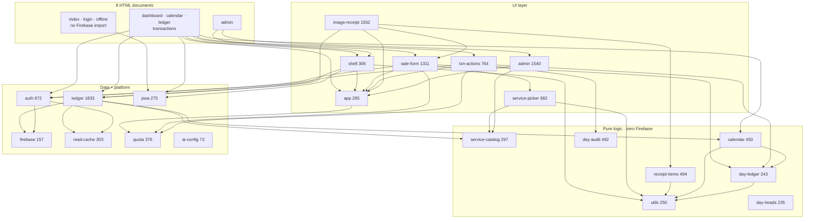

# Architecture

[TrustX Ledger](https://github.com/arshinmrelju/leadger) is a **static** Progressive Web App: eight
HTML documents, twenty-one ES modules, nine stylesheets, and no build step. There is no bundler, no
transpiler, no framework, and `package.json` declares **zero** dependencies — the only two scripts
in it are `test` and `test:rules`.

Everything below is enforced by `tests/module-graph.mjs`, which walks the import edges and fails
the build on a cycle, a bare specifier, or a Firebase version that drifts from the import maps.

---

## The shape

Lines are **module sizes in lines**, from the repository at `v0.13.1`.

---

## The four tiers

| Tier | Modules | Rule |
|---|---|---|
| **Pure logic** | `utils`, `service-catalog`, `day-heads`, `day-ledger`, `calendar`, `day-audit`, `receipt-items` | No Firebase import, no DOM. Directly unit-testable, and they are. |
| **UI** | `app`, `shell`, `sale-form`, `service-picker`, `txn-actions`, `image-receipt`, `admin` | Talks to the DOM and calls the data tier. |
| **Data** | `ledger`, `auth`, `read-cache`, `quota` | The only modules that touch Firestore or the RTDB. |
| **Platform** | `firebase`, `pwa`, `ai-config`, `sw.js` | SDK wiring, service worker, optional Gemini key. |

`tests/ledger.mjs` imports the pure tier directly under Node and exercises it without a browser —
that is why the money arithmetic is tested at all. `tests/receipt-scan.mjs` does the same for
`receipt-items.js`, which is where a scanned bill's lines are read, priced and matched.

`receipt-items` is in the pure tier for the same reason as the rest of them: the Gemini extractor
and the offline OCR path both hand it whatever they managed to read and need the same answer — a
list of honest line items, priced the way `createTransaction()` will recompute them. A module with
no DOM in it is a module whose arithmetic can be checked against real bills in a test instead of
against a customer's money.

---

## Load order

`index.html` and `offline.html` import **no** Firebase. This is deliberate: the gateway must paint
and register the service worker even if the SDK never loads.

| Page | Modules it imports |
|---|---|
| `index.html` | `pwa` |
| `login.html` | `firebase`, `pwa`, `auth` |
| `dashboard.html` | `app`, `utils`, `day-heads`, `ledger`, `auth`, `shell`, `sale-form`, `image-receipt` |
| `calendar.html` | `app`, `utils`, `calendar`, `ledger`, `day-ledger`, `auth`, `shell`, `sale-form` |
| `ledger.html` | `app`, `utils`, `day-heads`, `ledger`, `day-ledger`, `txn-actions`, `auth`, `shell`, `sale-form`, `calendar` |
| `transactions.html` | `app`, `utils`, `ledger`, `auth`, `shell`, `sale-form`, `txn-actions`, `calendar` |
| `admin.html` | `admin`, `app`, `utils`, `calendar`, `day-heads`, `day-audit`, `service-catalog`, `ledger`, `auth`, `shell` |
| `offline.html` | none — a static page, by design |

Firebase itself is loaded by an **import map** pinned to `12.18.0`, so every module that needs the
SDK imports the bare specifier `firebase/firestore` and gets the pinned URL.

`admin.html` is in that table like the rest, and it is the reason the console's information
architecture could stay different while its chrome did not. `initAppShell({ requireAdmin:
true })` draws the sidebar, top bar, user chip and mobile tab bar and resolves the grant;
`renderOwnerConsole(ctx)` then owns only what the shell cannot: the admin proof and the
promotion, the four receipt chips and the figures on the sheet. A different navigation inside
the page is no longer a different page frame.

---

## The one hard invariant

> **A sale document and the day head that counts it are committed in a single
> `writeBatch`, and `firestore.rules` re-derives the counter delta.**

The client computes what the counters should become. The rules recompute it from the transaction
document and refuse the batch if the two disagree. A bug in the client cannot inflate a day's
revenue; it can only fail the write with a named reason.

Consequences that shape the code:

| Consequence | Where it shows up |
|---|---|
| A day head must exist before any sale | `ensureDayHead` runs **outside** the batch — a batch cannot create a document that another rule must `get()` |
| A photo must be written **after** its sale | `existsAfter` only sees documents written earlier in the same batch, so `js/ledger.js` orders the sale first |
| Counter writes are bounded, not proved | `boundedCounterStep` allows at most one sale of movement; the *sale's* rule proves the delta was exact |
| A closed day is refused by the rules, not the UI | `dayOpen(dateKey)` is re-checked on every create/update/delete |

---

## Scanning a bill

A bill is a **list**, and the scanner keeps it that way. The Gemini prompt asks for an `items` array
— one entry per line the customer was charged for — and `js/receipt-items.js` normalises whatever
arrives (that array, or raw OCR text) into line items priced the way `createTransaction()` will
recompute them. `js/image-receipt.js` then routes on the count:

| The bill had | What happens |
|---|---|
| one line | the existing sale form, prefilled, with the photo attached |
| several lines | a review list **inside the scan modal** — one row per line, each with its own service search, quantity, rate and line total — and the bill is saved as a batch |

Three decisions are worth stating, because each of them is a choice against the obvious one:

- **The review lives in the scan modal, not in the sale form.** Sending a five-line bill through the
  one-sale form five times is the manual typing the scanner exists to remove.
- **The photo rides with the first line only.** A receipt image is one Firestore document per sale,
  so one bill cannot be attached five times; the remaining lines are the amounts that were on the
  same paper.
- **Lines are written one at a time, and a written line leaves the list.** A failure half way
  therefore leaves exactly the unpaid lines on screen, with the reason named, instead of a batch
  that is all-or-nothing and cannot say which half went in.

A name the catalog does not have is a **question, not a refusal**. `rankCatalogMatches()` returns a
confident `match` (same threshold the app has always used) *and* the closest `candidates`; the
review row shows the name as it was read with those near misses one tap away, and offers to add the
name as a new service at the rate the bill printed. The single-line path does the same through the
sale form's suggestion panel (`celebrateSavedSale` / `emitSaleRecorded` in `js/sale-form.js` are the
shared entry points the scanner uses, so a scanned sale and a typed one behave identically).

---

## Read caching

`js/read-cache.js` (`createReadCache`) wraps the queries the shell makes so that switching from
the ledger to the calendar and back does not re-hit Firestore. It is dropped explicitly — a sale,
a service rename, or an archive invalidates the day, the catalog and the history together, so a
stale read is never shown as current.

---

## Quota metering

`js/quota.js` counts reads and writes per browser per day and is checked **before** a write is
attempted, so an exhausted quota produces a message naming the reset time instead of a Firestore
error. This is metering and UX only — it is a client-side counter, not a server-side rate limit.
See [`SECURITY.md`](SECURITY.md#what-this-does-not-protect).

---

## Two databases

| | Cloud Firestore | Realtime Database |
|---|---|---|
| Holds | everything that matters — heads, sales, services, grants, shop | expenses, read-only |
| Why | rules can `get()` other documents, so one rule can check a service is active, a day is open, and a grant is live | rules cannot read Firestore, so anything security-sensitive must live in Firestore |
| Client SDK | modular `12.18.0` via import map | REST, signed in with the Firebase ID token |

The service catalog was **moved out of** the RTDB for exactly this reason: while it lived there,
rules could not verify at write time that the service being sold existed and was active. The
migration is recorded in `firestore.rules:616-619`.

---

## Offline

| Piece | File | Behaviour |
|---|---|---|
| Precaching | `sw.js` | cache `v10`, 57 files (53 app + 4 pinned Firebase SDK bundles), install-time |
| Navigation | `sw.js` | network first, cache fallback, then `offline.html` |
| App data | Firestore | `persistentLocalCache` + multi-tab, so an open shop keeps reading while offline |
| Writes while offline | — | not queued. A sale needs the rules to approve it, and the rules are server-side |

`offline.html` therefore says what is true: **the data on this device is safe, but a sale needs a
connection.**

---

## PWA

| Field | Shop (`manifest.webmanifest`) | Owner (`manifest-admin.webmanifest`) |
|---|---|---|
| `id` / `start_url` | `/dashboard.html` | `/admin.html` |
| `scope` | `/` (pages share no prefix) | `/admin` (owns `admin.html` + `admin-login.html` only) |
| `display` | `standalone` | `standalone` |
| `theme_color` | `#132b1e` | `#5b5bd6` |
| `background_color` | `#f7f3ea` | `#f7f3ea` |
| Icons | `icon-192`, `icon-512`, `icon-maskable-512`, plus SVG | `icon-owner-*` set (indigo), plus SVG |
| Shortcuts | Today · Transactions · Calendar · Day ledger | — |

Shop pages link the shop manifest; `admin.html` + `admin-login.html` link the owner manifest, so a desktop shop install opens the dashboard and an owner install opens the console.

Icons are derived from `assets/logo.svg` (shop) and `assets/logo-owner.svg` (console) and are rebuildable with `node tools/make-icons.mjs`
(needs headless Chrome). See [`DEVELOPMENT.md`](DEVELOPMENT.md).

---

## Configuration

There is **no build step and no `.env` in the browser.** Configuration is a literal in source.

| What | Where | Notes |
|---|---|---|
| `FIREBASE_CONFIG` | `js/firebase.js:34` | The real web config. Public by design — see below. |
| `geminiApiKey` | `js/ai-config.js:33` | Shipped as the placeholder `YOUR_GEMINI_API_KEY_HERE`. |
| `maxImageSizeMb` | `js/ai-config.js:39` | `3.5` |
| `downscaleLongEdge` / `jpegQuality` | `js/ai-config.js:40-41` | `1400` px / `0.82` — the AI copy |
| `storeLongEdge` / `storeJpegQuality` | `js/ai-config.js:47-48` | `1000` px / `0.72` — the copy stored with the sale |

`isGeminiConfigured()` (`:53`) rejects any key shorter than 10 characters or containing `YOUR_`,
`XXXXXXXX` or `xxxx`, so the committed placeholder can never be mistaken for a working key. While
it is a placeholder the app runs **fully offline OCR** on Tesseract.js and says so.

Tool scripts, which *do* run in Node, take real environment variables:

| Variable | Used by | Purpose |
|---|---|---|
| `FIREBASE_PROJECT_ID` | `tools/bootstrap-access.mjs:219` | Which project to write the allowlist to |
| `GOOGLE_APPLICATION_CREDENTIALS` | `tools/bootstrap-access.mjs:243` | Service-account key for the Admin SDK |
| `FIRESTORE_EMULATOR_HOST` | `tools/bootstrap-access.mjs:236` | Point the allowlist tool at the emulator instead |

`.env.example` documents the CLI variables (`FIREBASE_PROJECT_ID`,
`FIREBASE_PROJECT_ALIAS`) and states plainly that the web config is not a secret.

`js/firebase.js` exports a `FIREBASE_CONFIG` object. A Firebase web config is **public by
design** — it identifies the project, it does not authenticate. What actually authenticates is
`firestore.rules`, and no credential of any kind is committed to this repository.