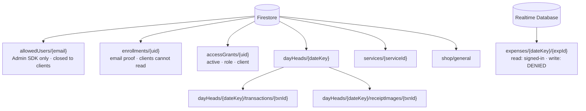

# Data Model

Every document and field in [TrustX Ledger](https://github.com/arshinmrelju/leadger), as enforced
by [`firestore.rules`](../firestore.rules) and [`database.rules.json`](../database.rules.json).

Two stores, chosen by what each one's rules language can express:

- **Cloud Firestore** — everything that matters. Rules here can `get()` other documents, so one
  rule can check that a service is active, a day is open, and a browser is trusted.
- **Realtime Database** — expenses only, read-only to clients. RTDB rules cannot read a Firestore
  grant, so nothing security-sensitive may live there.

Money is stored as **integer paise**. There is no floating-point currency anywhere.

---

## Firestore paths at a glance



Anything not listed is refused by the catch-all at `firestore.rules:919-921`:

```
match /{document=**} {
  allow read, write: if false;
}
```

---

## `allowedUsers/{email}` — the allowlist

`firestore.rules:234-236`

```text
allow read, write: if false;
```

Closed to clients in **both** directions. It is written once by
[`tools/bootstrap-access.mjs`](../tools/bootstrap-access.mjs) with the Admin SDK, which bypasses
these rules because it authenticates as the project owner rather than as a browser.

| Field | Type | Notes |
|---|---|---|
| `role` | string | `shop` or `admin` — read by `roleAllows()` at `firestore.rules:138` |

**If this document is missing, the user cannot enrol.** That is the intended fail-closed state, not
a bug to work around.

---

## `enrollments/{uid}` — proof of authorisation

`firestore.rules:276-281`

| Operation | Allowed when |
|---|---|
| `read` | never |
| `create` | `canProveEmail(uid)` |
| `update` | `canProveEmail(uid)` or `canAddAdminProof(uid)` |
| `delete` | never |

`validEnrollment` (`:217-226`) accepts only:

| Field | Type | Constraint |
|---|---|---|
| `scope` | string | `shop` or `admin` |
| `email` | string | `^[a-z0-9._%+-]+@[a-z0-9.-]+\.[a-z]{2,}$`, and must exist in `allowedUsers`, at a role that permits `scope` |
| `createdAt` | timestamp | must equal `request.time` |
| `createdBy` | string | must equal `request.auth.uid` |

Keyed by the caller's own uid, so two browsers cannot share or race for one another's proof. A
revoked browser may always re-prove itself, so a revoked machine recovers by signing in again
rather than by clearing site data; an **already-trusted** browser cannot touch its own proof except
to move `shop → admin` (`canAddAdminProof`, `:263-274`), and that is strictly additive.

---

## `accessGrants/{uid}` — trusted browsers

`firestore.rules:304-374`

| Field | Type | Constraint |
|---|---|---|
| `active` | bool | the whole revocation switch |
| `role` | string | `shop` or `admin` |
| `label` | string | 1–80 |
| `client.ua` | string | ≤ 100 |
| `client.lang` | string | ≤ 40 |
| `lastUsedAt` | timestamp | heartbeat |
| `createdAt` | timestamp | pinned after creation |
| `createdBy` | string | 1–128, pinned after creation |
| `updatedAt` | timestamp | must equal `request.time` |
| `updatedBy` | string | must equal `request.auth.uid` |

`client` may contain **only** `ua` and `lang` — `hasOnly(['ua','lang'])`.

### Operations

| Operation | Allowed when |
|---|---|
| `read` | own uid, or `isAdmin` |
| `create` | self-enrolment: own uid, no existing grant, and `enrollments/{uid}.scope == request.role` — **the role can never be richer than the proven scope** |
| `update` | one of four branches, below |
| `delete` | `admin()` |

### The four update branches

| Branch | Who | What it may change |
|---|---|---|
| **Admin** | `admin()` | `active`, `role`, `label` — never `createdAt`/`createdBy` |
| **Self-promotion** | own uid, currently `shop` + active | `shop` → `admin`, only with a valid **admin-scope** proof. `sameGrantIdentity` pins everything else. |
| **Reactivation** | own uid, currently `active: false` | back to `active: true` at `shop` only, with a valid **shop-scope** proof. A demoted admin can never re-promote this way. |
| **Heartbeat** | own uid | `lastUsedAt` only. `role` and `active` must be unchanged, so this can never keep a revoked browser alive. |

---

## `dayHeads/{dateKey}` — one document per business day

`firestore.rules:489-614` · `dateKey` matches `^\d{4}-\d{2}-\d{2}$` (Asia/Kolkata)

| Field | Type | Open day | Closed day |
|---|---|---|---|
| `dateKey` | string | must equal the path key | same |
| `state` | string | `open` | `closed` |
| `openedAt` | timestamp | survives close **and** reopen | — |
| `openedBy` | string | " | — |
| `counters` | map | see below | same |
| `closedAt` | timestamp | **must not be present** | must equal `request.time` |
| `closedBy` | string | **must not be present** | must equal `request.auth.uid` |
| `updatedAt` | timestamp | must equal `request.time` | same |
| `updatedBy` | string | must equal `request.auth.uid` | same |

`openHeadShape` (`:510-518`) uses `!doc.keys().hasAny(['closedAt','closedBy'])` — an open head
carries **no** closing stamp at all, so a stale `closedAt` can never ride along on a counter write.
Reopening therefore has to *delete* the stamp rather than blank it.

### `counters` — `countersOk` (`:404-418`)

| Field | Type | Range |
|---|---|---|
| `txnCount` | int | 0 – 1 000 000 |
| `grossPaise` | int | 0 – 100 000 000 000 000 |
| `cashPaise` | int | ≥ 0 |
| `upiPaise` | int | ≥ 0 |
| `cardPaise` | int | ≥ 0 |
| `duePaise` | int | ≥ 0 |
| `collectedPaise` | int | ≥ 0 |

Plus two identities that must always hold:

```text
grossPaise      == cashPaise + upiPaise + cardPaise + duePaise
collectedPaise  == grossPaise - duePaise
```

### Operations

| Operation | Allowed when |
|---|---|
| `read` | `trusted()` |
| `create` | `trusted()` && `validHeadCreate` — zeroed counters, `openedAt == request.time` |
| `update` | `trusted()` && one of: no-op re-assert · bounded step · close · reopen |
| `delete` | **never** — the register cannot be re-dated or erased |

`boundedCounterStep` (`:548-565`) allows the count to change by 0, +1 or −1 and each money field
by at most ±100 000 000 000 paise. It deliberately does **not** prove the delta — the transaction's
own rule does that.

---

## `dayHeads/{dateKey}/transactions/{txnId}`

`firestore.rules:620-768`

| Field | Type | Constraint |
|---|---|---|
| `txnId` | string | ≤ 120, must equal the path key |
| `serviceId` | string | 1–120; the document must **exist** and have `active == true` at write time |
| `serviceName` | string | 1–80; must equal the service document's current `name` |
| `quantity` | int | 1 – 100 000 |
| `rate` | number | 0 – 10 000 000 paise |
| `total` | number | 0 – 100 000 000 000 paise, and **must equal `quantity * rate`** |
| `amounts` | map | see below |
| `paymentMethod` | string | `cash` · `upi` · `card` · `due` |
| `customerId` | string | ≤ 200 |
| `customerName` | string | ≤ 120 |
| `status` | string | `paid` or `pending` |
| `dateKey` | string | must equal the parent day |
| `createdAt` / `createdBy` | | immutable after create |
| `updatedAt` / `updatedBy` | | `updatedAt == request.time`, `updatedBy == request.auth.uid` |
| `hasReceipt` | bool | optional |
| `notes` | string | optional, ≤ 400 |

**Status must follow the method:** a `due` sale may be `pending` or `paid`; any other method must
be `paid`.

### `amounts` — `validAmounts` (`:426-450`)

| Field | Type | Constraint |
|---|---|---|
| `gross` | int | must equal `total` |
| `cash` | int | `> 0` if and only if `paymentMethod == 'cash'` |
| `upi` | int | `> 0` if and only if `paymentMethod == 'upi'` |
| `card` | int | `> 0` if and only if `paymentMethod == 'card'` |
| `due` | int | `> 0` if and only if `paymentMethod == 'due'` |
| `collected` | int | must equal `total - due` |

```text
cash + upi + card + due == total
collected               == total - due
```

Written without a ternary or a map because the rules language has neither. Each bucket is proved to
be either 0 or the whole total — as binding as a branch.

### Operations

| Operation | Rule |
|---|---|
| `read` | `trusted()` — also authorises the collection-group query behind the console's "All recent" |
| `create` | `trusted()` && `dayOpen(dateKey)` && `validTransactionDoc` && `headSteppedBy(…, step 1)` |
| `update` | `trusted()` && `dayOpen(dateKey)` && `validTransactionEdit` && `headShiftedBy(…)` |
| `delete` | `trusted()` && `dayOpen(dateKey)` && `headSteppedBy(…, step −1)` |

`headSteppedBy` (`:454-463`) re-derives every counter from the sale's own `amounts`.
`headShiftedBy` (`:467-476`) handles an edit, where `txnCount` is unchanged and only the split
moves.

**`hasReceipt` is pinned** (`:707`): once a sale says it has a photograph, an edit may neither
attach nor drop one. That stops a sale claiming to have no photo while its photo is still on file.

---

## `dayHeads/{dateKey}/receiptImages/{txnId}`

`firestore.rules:770-821` · created **after** the sale in the same batch

| Field | Type | Constraint |
|---|---|---|
| `txnId` | string | must equal the path key |
| `image` | string | `data:image/jpeg;base64,[A-Za-z0-9+/]+={0,2}`, 1 – 820 000 chars |
| `bytes` | int | decoded JPEG size, 1 – 614 400 |
| `capturedAt` | timestamp | must equal `request.time` |
| `createdBy` | string | must equal `request.auth.uid` |

| Operation | Rule |
|---|---|
| `read` | `trusted()` — **a photo stays readable on a closed day** |
| `create` | `trusted()` && `dayOpen` && `existsAfter(txnPath(dateKey, txnId))` |
| `update` | **never** — a scan is a record of what the paper said; re-scanning deletes and re-creates |
| `delete` | `trusted()` && `dayOpen` |

`matches` rather than `startsWith`, because Firestore rules have no `startsWith` and `matches`
anchors to the whole string — so this accepts a JPEG data URL and nothing else, with no payload
appended after the picture.

`existsAfter`, not `exists`: the sale is written in the same batch, so `exists()` (which judges the
world *before* the commit) would be false. One consequence is a rule about **write order** — a
document being written in a batch is visible to `existsAfter` only to writes **after** it, so
`js/ledger.js` commits the sale before its photograph.

---

## `services/{serviceId}`

`firestore.rules:827-875`

| Field | Type | Constraint |
|---|---|---|
| `serviceId` | string | ≤ 120, must equal the path key |
| `name` | string | 1–80 |
| `code` | string | ≤ 12 |
| `pricePaise` | number | 0 – 10 000 000 |
| `active` | bool | `false` is how a service is "removed" |
| `sortOrder` | number | — |
| `createdAt` / `createdBy` | | immutable |
| `updatedAt` / `updatedBy` | | `updatedAt == request.time` |

| Operation | Rule |
|---|---|
| `read` | `trusted()` |
| `create` | `trusted()` && `validServiceDoc` |
| `update` | `trusted()` && `validServiceUpdate` (pins `createdAt`/`createdBy`) |
| `delete` | **never** |

---

## `shop/general`

`firestore.rules:883-913` · one document, no delete

| Field | Type | Constraint |
|---|---|---|
| `name` | string | 1–80 |
| `phone` | string | ≤ 20 |
| `address` | string | ≤ 300 |
| `currency` | string | must be `INR` |
| `active` | bool | must be `true` |
| `createdAt` / `createdBy` | | immutable after create |

This used to be an RTDB path. Because RTDB rules cannot read a Firestore grant, `auth != null`
there meant *any* Google Firebase user could rewrite the shop's details. It now sits behind the
same `trusted()` gate as the money.

---

## Realtime Database — `expenses/{dateKey}/{expId}`

[`database.rules.json`](../database.rules.json)

```jsonc
"expenses": {
  ".read": "auth != null",
  ".write": false,
  "$dateKey": { "$expId": { /* .validate per field */ } }
}
```

| Field | Validation |
|---|---|
| `date` | string matching `^[0-9]{4}-[0-9]{2}-[0-9]{2}$` |
| `title` | string, 1–120 chars |
| `category` | string, 0–40 chars |
| `amountPaise` | number, 0 – 100 000 000 000 |
| `createdAt` | number |
| `createdBy` | string, 1–128 chars |

The dashboard reads this for the **Expenses** and **Net** cards, where
`net = paid − expenses` (`js/ledger.js:412`). `.write: false` means no client can write an expense
at all.

### Legacy paths, all closed

Every one of these is explicitly denied, which is what makes the migration safe:

```text
settings, settings/general, settings/security, settings/admin
enrollments
devices
admins
```

All are `".read": false, ".write": false`. The root is `".read": false, ".write": false`.

### How it is read

Through the modular **database** SDK (`firebase/database`), not raw REST:

```js
rt.get(rt.ref(b.rtdb, "expenses", dateKey))
rt.query(rt.ref(b.rtdb, "expenses"), rt.orderByKey(), rt.limitToLast(days))
```

`js/firebase.js:116-124` resolves the RTDB handle **defensively** — if `databaseURL` is wrong the
app still boots, because Firestore is the money path. Callers check `rtdb` and surface a clear
message rather than failing obscurely.
