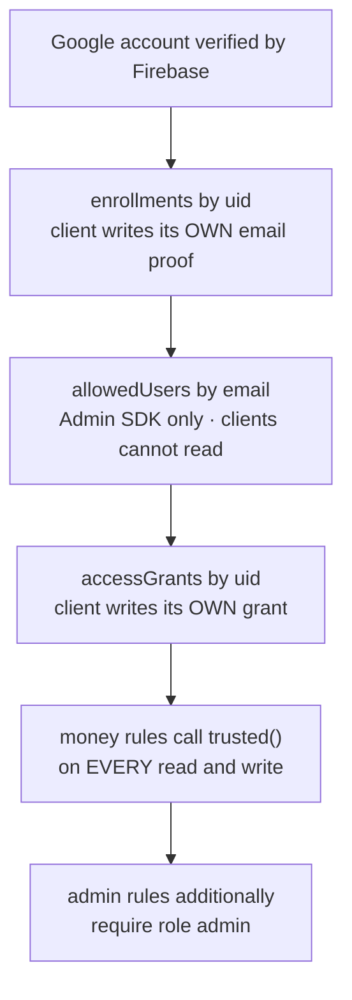

# Security

[TrustX Ledger](https://github.com/arshinmrelju/leadger) holds a shop's daily revenue. The design
goal was narrow and absolute: **the browser is never trusted, and no client bug can invent money.**

Two ideas carry the whole model:

1. **A signed-in Google account is not access.** It is only a claim.
2. **The server re-derives every number.** Counters are proven against the rows that moved them,
   not accepted from the client.

---

## The access chain



Each link is a rule, and each rule fails closed:

| Step | If the link is missing |
|---|---|
| No `allowedUsers/{email}` | the account cannot enrol at all |
| No `enrollments/{uid}` | the grant cannot be created |
| No `accessGrants/{uid}` | nothing can be read or written |
| `active: false` | revocation takes effect on the very next request |

---

## The helper functions

All in [`firestore.rules`](../firestore.rules).

| Function | Line | What it establishes |
|---|---|---|
| `signedIn()` | 90 | `request.auth != null` |
| `allowedUserPath(email)` | 109 | `/allowedUsers/{email}` |
| `isAllowedEmail(email)` | 124 | that document **exists** |
| `roleAllows(role, scope)` | 138 | the allowlist role permits the claimed scope |
| `isTrusted(uid)` | 160 | grant exists **and** `active == true` |
| `isAdmin(uid)` | 164 | the same, **and** `role == 'admin'` |
| `trusted()` | 171 | `signedIn() && isTrusted(request.auth.uid)` |
| `admin()` | 175 | `trusted() && isAdmin(request.auth.uid)` |
| `dayOpen(dk)` | 481 | the head exists and `state == 'open'` |

The important detail is `isTrusted` (`:160`): it reads the grant document **inside the rule**, on
every request. There is no cached "is this browser trusted" flag anywhere in the client. Revoking a
browser cannot race a stale session.

---

## Layers of validation

Nothing is validated in only one place.

| Layer | What it catches |
|---|---|
| `js/utils.js` | bad input before the network — `sanitizeQuantity`, `rateToPaise`, `computeTotalPaise` |
| `js/ledger.js` | missing day head, ordering, read-cache invalidation |
| `firestore.rules` | **everything**, authoritatively, including a hostile client |
| `tools/rules-check.mjs` | proves the rules behave, against a live emulator |

The client-side guards are a courtesy to the person using the app. They are not the control. The
comment at `firestore.rules:388-389` says so explicitly — the ranges in `validQuantity`,
`validRate` and `validTotal` are mirrored from `js/utils.js` so a bad write is caught before the
network *and* after it.

---

## The counter invariant

This is the centre of the design.

**Claim.** A transaction document and the day head that counts it are written in one batch, and the
rules recompute the head delta from the transaction itself.

```text
headSteppedBy(before, after, a, step)          firestore.rules:454
  after.txnCount      == before.txnCount      + step
  after.grossPaise    == before.grossPaise    + a.gross    * step
  after.cashPaise     == before.cashPaise     + a.cash     * step
  after.upiPaise      == before.upiPaise      + a.upi      * step
  after.cardPaise     == before.cardPaise     + a.card     * step
  after.duePaise      == before.duePaise      + a.due      * step
  after.collectedPaise== before.collectedPaise+ a.collected* step
```

`step` is `+1` on create and `−1` on delete. An edit uses `headShiftedBy` (`:467`), where
`txnCount` is unchanged and only the split moves.

**Why this matters.** A client that wants to add ₹1 crore to today's revenue has to make
`headSteppedBy` true, which means writing a transaction whose `amounts` justify it, whose
`total == quantity * rate`, and whose service exists and is active. Every one of those is a rule.
The alternative — trusting the client's arithmetic — would make the dashboard a suggestion.

### Why the head's own rule only *bounds* the step

`boundedCounterStep` (`:548`) allows at most ±1 sale of movement, and the comment at `:544-547`
explains why it stops there: the head cannot see the sale that moved it, so its own write rule can
bound the change but cannot prove it. The transaction's rule is what proves the delta was exact.
The two together are stronger than either alone.

---

## Three places the rules-language bit back

Firestore rules are not TypeScript. Three consequences are worth knowing before editing them.

### 1. A missing property read **raises**, it does not answer false

`firestore.rules:656-664`:

```text
&& (!('hasReceipt' in doc) || doc.hasReceipt is bool)
```

The `in` test comes **first**, because it is the only operand safe to evaluate when the field is
absent. Written the other way round, `||` still evaluates lazily, but the missing-property read
raises — so the rule refuses every sale that has no notes, with an evaluation error instead of a
plain no. Same pattern at `:707` for the pinned `hasReceipt`.

### 2. No `startsWith`, and `matches` is anchored

`firestore.rules:781-786`:

```text
&& doc.image.matches('data:image/jpeg;base64,[A-Za-z0-9+/]+={0,2}')
```

`startsWith` is a Realtime Database thing. `matches` anchors to the whole string, so this accepts a
JPEG data URL and **nothing else** — no payload appended after the picture.

### 3. `existsAfter` is order-sensitive, and only one way

`firestore.rules:792-807`:

- `exists()` judges the world **before** the commit, so the sale written in the same batch is not
  in it yet
- `getAfter(p).exists` does not survive this engine (`Property exists is undefined on object`)
- `existsAfter(p)` does

So `js/ledger.js` commits the **sale before its photograph**. Written the other way round, the
photo is refused for the company of a sale that is arriving in the very same commit.

---

## What a closed day actually does

| Operation | On a closed day |
|---|---|
| Read the day's head, sales, or photos | allowed |
| Create / edit / delete a sale | refused by `dayOpen(dateKey)` |
| Delete a photo | refused |
| Reopen the day | allowed — counters must be untouched, and the closing stamp must be **deleted** |

`openHeadShape` (`:510`) forbids `closedAt`/`closedBy` on an open head, so reopening has to remove
the stamp rather than blank it. `openedAt`/`openedBy` survive, so the day keeps the history of when
it opened. The head itself can never be deleted (`:613`) — a day can go open → closed → open, but
its identity is fixed from creation.

---

## Revocation

| From | Effect |
|---|---|
| `active: false` via the console | the next request fails `isTrusted` — immediate, no logout needed |
| `grant` deleted via the console | same, plus the proof remains so the browser can re-enrol |
| `grant` deleted + `enrollments` cleared | the browser must sign in again and prove itself |

The heartbeat branch (`firestore.rules:358-371`) is the subtle one: a browser may move **only** its
own `lastUsedAt`, with `role` and `active` pinned. So refreshing a grant cannot keep a revoked
browser alive — there is no path from revoked back to trusted without a valid proof.

---

## Client-side gates, and why they are not the control

`js/auth.js` `guardPage` / `requireAccess` redirect a browser that is not trusted, and the
Owner console gates itself with `requireAccess()` + `grantAdminAccess()` — it does **not** call
`initAppShell`, which is what makes it a standalone page in the first place. Both are **user
experience**. The HTML of every page is served to anyone who asks for it — the gate is the rules,
on every read and write. Nothing in `js/` is a security boundary.

---

## What this does **not** protect

Honest gaps. None of these are worked around in the code; each is named where it occurs.

| Gap | Where | Why it is not fixed here |
|---|---|---|
| **Any signed-in Firebase user can read `expenses`** | `database.rules.json:40` — `".read": "auth != null"` | RTDB rules cannot read a Firestore grant, so an allowlist check is not expressible there. Expenses are the one value left in the RTDB for this reason. |
| **No rate limiting** | `js/quota.js` | Quota is metered client-side for UX before a write is attempted. It is not a server-side limit, and a hostile client ignores it. |
| **`DATABASE-RULES.md` is stale** | that file | It still documents `securitySecrets`, which is not a path in the rules. The rules are the source of truth; the prose is not. |
| **Latent bug in `txn-actions.js`** | edit-save catch path | A `row` variable is out of scope in the catch branch. It is a client-side error path, not a rule. |
| **The Gemini key is client-side** | `js/ai-config.js:33` | `geminiApiKey` is a literal in source, so a real key pasted there is readable by anyone using the browser. It is shipped as the placeholder `YOUR_GEMINI_API_KEY_HERE`, and the offline Tesseract.js path is the recommended default. Restrict a real key by HTTP referrer in Google Cloud Console, as `ai-config.js:12-13` suggests. |

The one thing that is *not* a gap, because it is often mistaken for one: **the Firebase web config
in `js/firebase.js` is public by design.** It identifies the project; it does not authenticate.
Access is decided by `firestore.rules`.

---

## Secrets in this repository

Checked and confirmed absent:

| Item | State |
|---|---|
| Service-account JSON / private keys | none committed |
| `.env` | gitignored; only `.env.example` is tracked |
| Admin SDK credentials | `GOOGLE_APPLICATION_CREDENTIALS` at runtime, or the Firebase CLI token |
| Firebase web config | present in `js/firebase.js` — public by design, see above |
| Gemini API key | placeholder `YOUR_GEMINI_API_KEY_HERE` in `js/ai-config.js` |

`tools/bootstrap-access.mjs` and `tools/cleanup-firestore.mjs` read either
`GOOGLE_APPLICATION_CREDENTIALS` or the Firebase CLI token from
`~/.config/configstore/firebase-tools.json`. Neither file is in the repository.

---

## Hosting headers

From [`firebase.json`](../firebase.json):

| Header | Value |
|---|---|
| `Strict-Transport-Security` | `max-age=31536000; includeSubDomains` |
| `X-Content-Type-Options` | `nosniff` |
| `X-Frame-Options` | `SAMEORIGIN` |
| `Referrer-Policy` | `strict-origin-when-cross-origin` |
| `Permissions-Policy` | accelerometer, camera, geolocation, gyroscope, magnetometer, microphone, payment, usb — all `()` |

Cache lifetimes are set per path: `no-cache` for HTML and `sw.js`, `max-age=3600` for JS, CSS and
the manifest, `max-age=86400` for assets.

`Cross-Origin-Opener-Policy` is deliberately **not** set to `same-origin`: `signInWithPopup` needs
the popup to keep a handle on the opener, and breaking sign-in to gain a header this app does not
need would be a bad trade.

---

## Testing the rules

```bash
npm run test:rules
```

[`tools/rules-check.mjs`](../tools/rules-check.mjs) starts a throwaway Firestore emulator, points it
at a **test-only copy** of the rules, and drives the sale/head scenarios through it over the public
REST API. Two emulator limits shape the harness, and neither weakens what is checked:

1. `request.time` becomes a literal, so the `field == request.time` pins are satisfied with a fixed
   timestamp.
2. `getAfter` is only available inside a batch, so the harness commits real batches rather than
   single writes.

It is kept out of `npm test` because it needs a running emulator.
